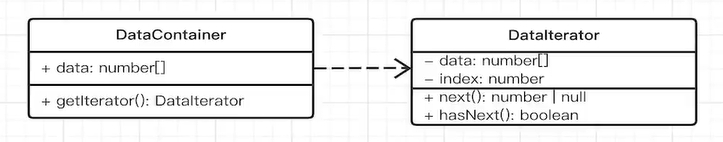

# 迭代器模式

迭代器模式解决的问题是如何更加方便友好的遍历一个有序数据集合，在js中大致有以下有序集合：`字符串、Map、Set、数组、NodeList等DOM集合、argumennts`

简单的for循环不是迭代器，比如下面代码

```ts
const arr = ['a', 'b', 'c'];
const len = arr.length;
for (let i=0; i<length; i++) {
    console.log(arr[i]);
}
```

上面代码的循环，你需要数组长度`arr.length`，你还需要如果获取数组元素`arr[i]`，很不符合高内聚低耦合原则，数组很多信息公开了。


再比如下面的代码：

```ts
const plist = document.querySelectorAll('p');
pList.forEach(p => console.log(p))
```

上面就是一个简单的迭代器了，我们用 `forEach` 来遍历，不需要知道数组的长度

## ts实现一个简易的迭代器

```ts
class DataContainer {
  public data = ["a", "b", "c"];
  getInterator() {
    // 获取迭代器
    return new DataIterator(this);
  }
}

// 实现一个迭代器
class DataIterator {
  private data: string[];
  private index = 0;
  constructor(container: DataContainer) {
    this.data = container.data;
  }
  // 是否有下一个元素
  hasNext() {
    return !(this.index >= this.data.length);
  }
  // 将光标移动到下一个元素，有则返回，无则返回null
  next() {
    if (this.hasNext()) {
      return this.data[this.index++];
    }
    return null;
  }
}

const container = new DataContainer();
const interator = container.getInterator();
while (interator.hasNext()) {
  const str = interator.next();
  console.log(str); // a b c
}
```

迭代器就是不通过for去遍历，

对应的UML图如下：




## 自带的Symbol.iterator

前面说了，在在js中所有的有序集合：`字符串、Map、Set、数组、NodeList等DOM集合、argumennts`

都自带了`Symbol.iterator`方法，执行该方法，返回一个迭代器对象。

```ts
const arr = ['a', 'b', 'c'];
const iterator = arr[Symbol.iterator]();
iterator.next(); // {value: 'a', done: false}
iterator.next(); // {value: 'b', done: false}
iterator.next(); // {value: 'c', done: false}
iterator.next(); // {value: undefined, done: true}
```

根据上面的，来实现自带的迭代器

```ts
interface IteratorRes {
  value: number | undefined;
  done: boolean;
}

class CustomInterator {
  private length = 2;
  private index = 0;

  next(): IteratorRes {
    this.index++;
    if (this.index <= this.length) {
      return { value: this.index, done: false };
    }
    return { value: undefined, done: true };
  }

  [Symbol.iterator]() {
    return this;
  }
}

const cusIter = new CustomInterator();
console.log(cusIter.next());
console.log(cusIter.next());
console.log(cusIter.next());
```


