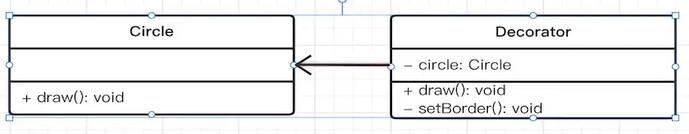
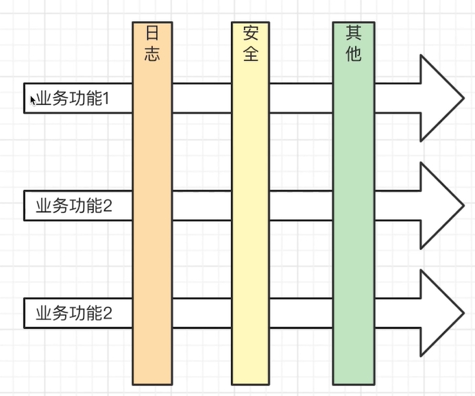

# 装饰器模式

装饰器模式：针对一个对象，能动态的添加新功能，但不改变它原有的功能。就像手机壳一样，可以装饰手机，但不影响手机原有功能。

## 代码演示

```ts
class Circle {
  draw() {
    console.log("画一个圆形");
  }
}

class Decorator {
  private circle: Circle;
  constructor(cle: Circle) {
    this.circle = cle;
  }
  draw() {
    this.circle.draw(); // 画圆
    this.setBorder(); // 绘画边框
  }
  private setBorder() {
    console.log("设置边框颜色");
  }
}

const circle = new Circle();
const decorator = new Decorator(circle);
decorator.draw();
```

对应UML图如下：



而在ts中，装饰器真正使用如下:

```ts
function testable(target: any) {
  target.isTestable = true;
}

@testable
class Foo {
  static isTestable?: boolean;
}

console.log(Foo.isTestable);
```

## AOP面向切面编程



如上图所示，我们平时开发过程中，开发好一个个业务功能，每个业务功能都可以来一刀，比如切一下加入日志管理，再切一下加入安全校验等等。

