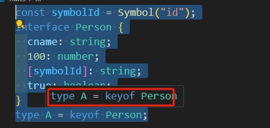
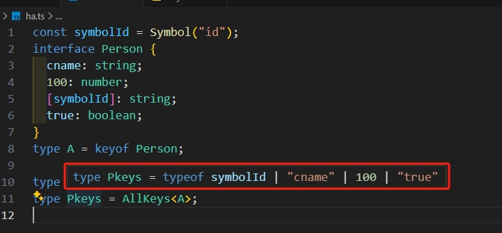

# 了解keyof

通过 `keyof` 可以获取到对象上对应的key组合的联合类型。

需要注意一下的是，如果key是Symbol类型、number类型、boolean类型的时候，能赋值的值有类型要求

```ts
const symbolId = Symbol("id");
interface Person {
  cname: string;
  100: number;
  [symbolId]: string;
  true: boolean;
}

type A = keyof Person;
const aa: A = symbolId; // 只能是key中的symbol，不能其他symbol
const bb: A = 'true';   // 只能是一个字符串的true，而不是boolean型的true
const cc: A = 100;      // 只能是一个number类型的100，而不能是string类型的'100'
```

在使用keyof中，例如下面代码：

```ts
const symbolId = Symbol("id");
interface Person {
  cname: string;
  100: number;
  [symbolId]: string;
  true: boolean;
}
type A = keyof Person;
```

鼠标移动上去的时候，只看到了



对我们开发不够直观，如果更加直观的看出来呢？我们可以封装一个泛型

```ts
type AllKeys<T> = T extends any ? T : never;

// 将上面的类型A传入泛型中
type Pkeys = AllKeys<A>;
```

再用鼠标看，就能看出具体有哪几种值了

