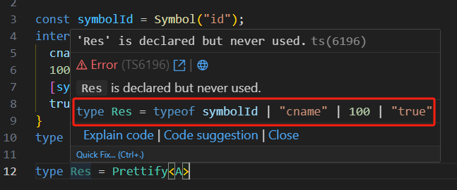

# keyof运算符

通过 `keyof` 可以获取到对象上对应的 key 组合的联合类型。

```ts
interface T {
  0: boolean;
  a: string;
  b(): void;
}

type KeyT = keyof T; // 0 | 'a' | 'b'
```

在js中，一个对象的key值只能是 `string | number | symbol`，因此 

```ts
type KeyT = keyof any; // string | number | symbol
```


对于没有自定义键名的类型使用 keyof 运算符，返回`never`类型，表示不可能有这样类型的键名。

```ts
type KeyT = keyof object;  // never
```

上面示例中，由于`object`类型没有自身的属性，也就没有键名，所以`keyof object`返回`never`类型。


如果对象属性名采用索引形式，keyof 会返回属性名的索引类型。

```ts
// 示例一
interface T {
  [prop: number]: number;
}
type KeyT = keyof T; // number

// 示例二
interface A {
  [prop: string]: number;
}
type KeyA = keyof A; // string | number
```

上面的示例二，`keyof A` 返回的类型是 `string|number`，原因是 js 属性名为字符串时，包含了属性名为数值的情况，因为数值属性名会自动转为字符串。


如果 keyof 运算符用于数组或元组类型，得到的结果可能出人意料

```ts
type Result = keyof ['a', 'b', 'c'];
// 返回 number | "0" | "1" | "2" | "length" | "pop" | "push" | ···
```

上面示例中，`keyof` 会返回数组的所有键名，包括数字键名和继承的键名


对于联合类型，`keyof` 返回成员共有的键名

```ts
type A = { a: string; z: boolean };
type B = { b: string; z: boolean };

type KeyT = keyof (A | B); // 返回 'z'
```

对于交叉类型，keyof 返回所有键名

```ts
type A = { a: string; x: boolean };
type B = { b: string; y: number };

type KeyT = keyof (A & B); // 返回 'a' | 'x' | 'b' | 'y'

// 相当于
keyof (A & B) ≡ keyof A | keyof B
```


keyof 取出的是键名组成的联合类型，如果想取出键值组成的联合类型，可以像下面这样写。

```ts
type MyObj = {
  foo: number,
  bar: string,
};

type Keys = keyof MyObj;
type Values = MyObj[Keys]; // number|string
```

上面示例中，`Keys` 是键名组成的联合类型，而 `MyObj[Keys]` 会取出每个键名对应的键值类型，组成一个新的联合类型，即 `number | string`


需要注意一下的是，如果key是 `Symbol类型 / number类型 /boolean类型`的时候，能赋值的值有类型要求

```ts
const symbolId = Symbol("id");
interface Person {
  cname: string;
  100: number;
  [symbolId]: string;
  true: boolean;
}

type A = keyof Person;

// 因为key [symbolId] 是一个symbol，所以赋值只能是key中的symbol，不能其他symbol
const aa: A = symbolId;
// 因为key true 是一个boolean，js会自动转为字符串类型的'true'，所以赋值只能是一个字符串的true，而不是boolean型的true
const bb: A = 'true';
// 因为key 100 是一个number，js支持数字作为key，所以赋值只能是一个number类型的100，而不能是string类型的'100'
const cc: A = 100;   
```

`keyof`无法获取类上的静态属性和静态方法

```ts
class Order {
  orderId: number = 1;
  ordreName: string = "Mobile";
  static count: number = 0;
  printOrder() {}
  static getCount() {}
}

type OrderKeys = keyof Order; // "orderId" | "ordreName" | "printOrder"
```


由于 keyof 返回的类型是 `string|number|symbol`，如果有些场合只需要其中的一种类型，那么可以采用交叉类型的写法。

```ts
type Obj = { cname: string; age: number }
type MyKeys<Obj extends object> = Capitalize<keyof Obj>; // ts报错 Type 'number' is not assignable to type 'string'
```

上面示例中，类型`Capitalize<T>`只接受字符串作为类型参数，传入 `keyof Obj` 会报错，原因是这时的类型参数是`string|number|symbol`，跟字符串不兼容。采用下面的交叉类型写法，就不会报错。

```
type MyKeys<Obj extends object> = Capitalize<string & keyof Obj>;
```

上面示例中，`string & keyof Obj` 等同于 `string & string|number|symbol` 进行交集运算，最后返回 `string`，因此 `Capitalize<T extends string>` 就不会报错了。


## keyof的使用场景

### 场景1：约束参数

比如下面代码，想要取某个对象的某个key上的值：

```js
function prop(obj, key) {
  return obj[key];
}
```

上面如果改为ts：

```ts
function prop(obj: { [p:string]: any },key: string):any {
  return obj[key];
}
```

上面的约束过于宽松，第2个参数 `key:string`，我可以传递任何类型的字符串。

如果使用上`keyof`约束下

```ts
function prop<Obj, K extends keyof Obj>(obj:Obj, key:K):Obj[K] {
  return obj[key];
}
```

上面示例中，`K extends keyof Obj`表示`K`是`Obj`的一个属性名，传入其他字符串会报错。返回值类型`Obj[K]`就表示`K`这个属性值的类型。

### 场景2：用于类型映射

类型映射可以具体看[015-类型映射](./015-类型映射.md)一章


## 封装一个 Prettify 方便查看key

在使用`keyof`中，例如下面代码：

```ts
const symbolId = Symbol("id");
interface Person {
  cname: string;
  100: number;
  [symbolId]: string;
  true: boolean;
}
type A = keyof Person;
```

我们鼠标移动上去的时候，只看到了


对我们开发不够直观，如果更加直观的看出来呢？我们可以封装一个泛型

```ts
export type Prettify<T> = {
  [K in keyof T]: T[K];
} & {};

// 将上面的类型A传入泛型中
type Pkeys = Prettify<A>;
```

再用鼠标看，就能看出具体有哪几种值了




## 类型递归

`in keyof` 用来做类型递归，类似 `for..in..`

```ts
interface Person {
  name: string;
  age: number;
  mobile: number;
}

type PersonValType = {
  [P in keyof Person]: Person[P];
};
```

我们知道 `keyof Person` 得到的是key的联合类型，等效于 `keyof Persion = name | age | mobile`

因此上面等于

```ts
type PersonValType = {
  [P in 'name' | 'age' | 'mobile']: Person[P];
};
// 
// 即等于下面
type PersonValType = {
    'name': Person['name'],
    'age' Person['age'],
    'mobile': Person['mobile']
}
```

`P in 'name' | 'age' | 'mobile'` 在ts中，会逐个遍历递归得到 `name/age/mobile`，并赋值给P

## 数组类型递归

`in keyof` 也可以用在数组上，既可以遍历数组下标，也可以遍历数组元素

```ts
const arr = ["a", "b", "c"] as const;
type Arr = typeof arr;

type NewArr = {
  [K in keyof Arr]: string;
};
```

鼠标引入 `NewArr` 可以看出，`NewArr` 的下标就是 `数组arr` 的下标 `0/1/2`

如果我们想要拿到数组元素的，可以使用 `数组[number]`

```ts
const arr = ["a", "b", "c"] as const;
type Arr = typeof arr;

type NewArr = {
  [K in keyof Arr[number]]: string;
};
```


