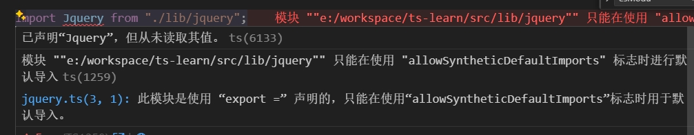
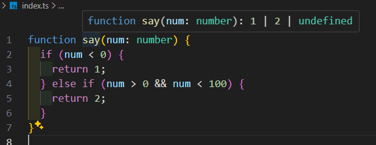
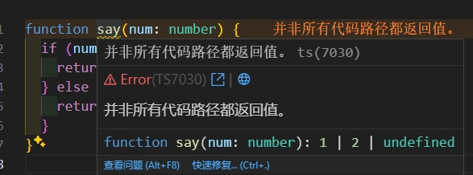
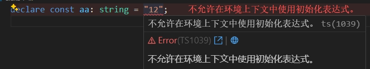

# tsconfig配置的compilerOptions

compilerOptions的配置是最多并且核心的配置，格式如下：

```json
{
  "compilerOptions": {
    "outDir": "./built",
    "allowJs": true,
    "target": "es5"
  }
}
```

具体配置如下：

## baseUrl

绝大多数时候，我们项目都是以 `tsconfig.json` 为项目根目录，所以一般不用配置 baseUrl 

如果配置了，那么 `import` 的时候省略的前缀路径，比如现在有代码

```text
learn-ts
  ├── src
  │     ├── index.ts
  │     └── utils.ts
  └── tsconfig.json
```

而代码:

```ts
// src/index.ts
import { cname } from 'utils';
console.log(cname);
```

这样回去找node_module的文件

而配置 `{ baseUrl:'./src' }` 之后，会将`baseUrl`和`utils`组合起来变成`src/utils`查找。

## lib

配置项目中使用到哪些 js 库，比如下面代码

```ts
const myset = new Set();
document.querySelector('.sd');
```

ts会提示

```text
找不到名称“Set”。是否需要更改目标库? 请尝试将 “lib” 编译器选项更改为“es2015”或更高版本
找不到名称“document”。是否需要更改目标库? 请尝试更改 “lib” 编译器选项以包括 “dom”
```

因此我们需要加上配置

```json
{
  "compilerOptions": {
    "lib": ["ESNext", "DOM"]
  }
}
```

这样ts就认识 `Set/document` 语法

支持的配置如下，更多配置可看[github仓库](https://kkgithub.com/microsoft/TypeScript/tree/main/src/lib)：

- `ES5`：
- `ES2015`：
- `ES6`：
- `ES2016`：
- `ES7`：
- `ES2017`：
- `ES2018`：
- `ES2019`：
- `ES2020`：
- `ES2021`：
- `ES2022`：
- `ESNext`：es的下一语法糖，会时刻以最新的语法
- `DOM`：支持了各种DOM相关的api
- `WebWorker`：
- `ScriptHost`：

**很重要，不配置lib的情况：**

如果不配置lib，会发现上面的代码也是能正常运行的，这是因为ts对 lib 会根据 `target` 设置不同的默认配置

- `ES5`：`["DOM", "ES5", "ScriptHost"]`
- `ES6`/`ES2015`：`["DOM", "ES6", "DOM.Iterable", "ScriptHost"]`
- `ES2016`及更高版本：`["DOM", "ES2016", "DOM.Iterable", "ScriptHost"]`

## target

支持以下的值：

- es3
- es5
- es6/es2015
- es2016
- es2017
- es2018
- es2019
- es2020
- es2021
- es2022
- esnext

target指定编译后的 js 版本，比如现在有下面代码：

```ts
class Person {
  constructor() {}
  sayHello() {
    return 'Hello';
  }
}
```

如果我们设置的是 `{ target: "ES2016" }` 则编译后如下：

```js
class Person {
  constructor() {}
  sayHello() {
    return 'Hello';
  }
}
```

因为es7中已经支持了class语法糖

如果我们设置 `{ target: "ES5" }` 则编译结果如下：

```js
var Person = /** @class */ (function () {
  function Person() {}
  Person.prototype.sayHello = function () {
    return 'Hello';
  };
  return Person;
})();
```

## module

编译后要使用什么规范，比如现有代码如下：

```ts
export const cname = 'xiaoming';
export default class Person {}
```

如果配置 `{ module:"commonjs" }` 则编译后代码：

```js
Object.defineProperty(exports, '__esModule', { value: true });
exports.cname = void 0;
exports.cname = 'xiaoming';
class Person {}
exports.default = Person;
```

如果配置 `{ module:"ESNext" }` 则编译后代码：

```js
export const cname = 'xiaoming';
export default class Person {}
```

可选值如下：

* none

* commonjs

* amd

* umd

* system

* es6/es2015

* es2020

* es2022

* esnext

* node16

* nodenext


> **很重要：**
>
> 如果不设置 `module` 选项，而 `target=es6`，那么 `module` 默认值为 `es6`，否则是 `commonjs`
>
> 如果配置 `{ module:"Preserve" }` 则告诉ts不要处理代码的导入导出（不要转移esm或commonjs）语法，交给其他编译器处理

## rootDir / rootDirs / outDir

`rootDir` 配置的是源码的目录，默认值：`./`。如果源代码都放在src目录，就可以配置 `{ rootDir:"./src" }`

`outDir` 配置编译后存放到哪个目录下。默认值：`./`，会将js和ts放在一起，我们习惯放在dist目录，那么只需要配置 `{ outDir: "./dist" }`

举个例子，现在有下面文件结构

```text
ts-learn
├── dist
├── src
│   └── index.ts
└── tsconfig.json
```

如果是 `{ rootDir: "./" }` 配置。则是以根目录作为源码路径，编译后的dist目录结构如下：

```text
ts-learn
├── dist
│   └── src
│       └── index.js
```

可以看到多一层src目录。

如果我们不想要，那么可以配置以 `src` 目录为根目录，修改配置为 `{ rootDir: "./src" }` 配置，编译后dist目录如下

```text
ts-learn
├── dist
│   └── index.js
```


`rootDirs`把多个不同目录，合并成一个虚拟目录，便于模块定位。

```
{
  "compilerOptions": {
    "rootDirs": ["bar", "foo"]
  }
}
```

上面示例中，`rootDirs` 将 `bar` 和 `foo` 组成一个虚拟目录

## moduleResolution

模块查找方式，可选值如下：

* `node`：采用 Node.js 的 CommonJS 模块算法，就是我们熟知的查找方式，查找node_modules的时候，现在当前目录查找，没有就往上目录找，一直找到全局
* `node16`或`nodenext`：采用 Node.js 的 ECMAScript 模块算法，从 ts 4.7 开始支持。
* `Classic`：和node相反，先从全局目录查找，找不到再往下面查找，这种是 ts 1.6之前的默认解析策略，不再建议使用
* `bundler`：是 ts 5.0 新增的一种方式，表示当前代码会被其他打包器（比如 Webpack、Vite、esbuild、Parcel、rollup、swc）处理，从而放宽加载规则，它要求`module`设为`es2015`或更高版本。

> **很重要：**
>
> 它的默认值与`module`属性有关
>
> ​	如果 `module = AMD 或 UMD 或 System 或 ES6/ES2015`，默认值为`classic`
>
> ​    如果 `module = node16`，默认值是 `node16`
>
>    如果 `module = nodenext`，默认值是 `nodenext`
>
> ​    其他情况下，默认值为 `Node`


## resolveJsonModule

是否允许在ts中import json文件，**默认：**`false`。

比如现在有一个文件`mock.json`，在ts中引入

```ts
import mock from './mock.json'; // error报错， 提示 找不到模块“./mock.json”。请考虑使用 "--resolveJsonModule" 导入带 ".json" 扩展的模块
console.log(mock);
```

这个时候就需要设置 `{ resolveJsonModule: true }` 即可

## allowJs / checkJs

`{ allowJs: true }` 开启后有2层作用，一个是允许了在 ts 文件中可以引入 js 文件，另一个是会将 js 文件也编译到 dist 目录（即使没有该 js 没有被引入）

`{ checkJs: true }` 开启后，ts 会去解析js文件，分析下是否存在ts问题，当设置 `true` 之后，会自动打开 `allowJs`

比如现在有个 js 文件：

```js
let cname = 'sdfsdf';
cname = 23;
```

上面将一个本来是string改为了number类型，js是完全没问题

而我们开启`{ checkJs: true }`之后既可以看到有提示 `不能将类型“number”分配给类型“string”`

说明 ts 去解析 js 文件并分析有没有ts语法问题

## declaration / declarationDir / declarationMap / emitDeclarationOnly

`{ declaration: true }` 设置为true，将为ts文件生成 `d.ts` 声明文件

`{declarationDir: './types'}` 指定 `d.ts` 文件的存放位置

`{ declarationMap: true }` 设置为true，在生成 `d.ts` 文件的同时生成 `d.ts.map` 的sourcemap文件，在查看并跳转到库的类型声明时非常有用，因为可以直接跳转到源代码，而不是跳转到类型声明文件

` {emitDeclarationOnly: true}` 只产生 `d.ts` 文件，不产生 js文件

```json
{
  "compilerOptions": {
    "declaration": true,
    "declarationDir": "./types"
  }
}
```

## sourceMap / mapRoot / inlineSourceMap / inlineSources / sourceRoot

`{ sourceMap: true }` 设置为true，在生成 js 文件的同时生成 `js.map` 的 sourcemap 文件，这个最大的好处，在浏览器中运行的时候，可以直接在浏览器看到对应ts文件的代码，也可以在ts是进行断点调试。

` { mapRoot: './' }` 指定 SourceMap 文件的位置。

```json
{
  "compilerOptions": {
    "sourceMap": true,
    "mapRoot": "https://my-website.com/debug/sourcemaps/"
  }
}
```

`{ inlineSourceMap: true }` 将 SourceMap 文件写入编译后的 JS 文件中，这样就不会单独生成一个`.js.map`文件

`{ inlineSources: true }`设置将原始的`.ts`代码嵌入编译后的 JS 中，它要求`sourceMap`或`inlineSourceMap`至少打开一个。

`sourceRoot`：在 SourceMap 里面设置 TypeScript 源文件的位置。

```
{
  "compilerOptions": {
    "sourceMap": true,
    "sourceRoot": "https://my-website.com/debug/source/"
  }
}
```

## isolatedModules

将每个文件作为单独的模块

## verbatimModuleSyntax

在开发中，我们会将类型export出去，在其他地方import，例如下面代码

```ts
// a.ts
interface Aaa {
  cname: string;
}
export { Aaa };

// index.ts
import { Aaa } from './a.ts';
```

我们知道 ts 经过处理后变成 js，上面的类型就会没有，但如果对于一些babel，这个时候就无法解析

因此我们更推荐将`{ verbatimModuleSyntax: true }`，开启之后，在类型的export，就需要加上type关键词

```ts
interface Aaa {
  cname: string;
}
export type { Aaa };
```

一般推荐开启，一方面语义化更好，一方面解决babel等编译器问题

## allowSyntheticDefaultImports 

`allowSyntheticDefaultImports`允许`import`命令默认加载没有`default`输出的模块。

比如，打开这个设置，就可以写`import React from "react";`，而不是`import * as React from "react";`。

## esModuleInterop

有些依赖库底层 为了兼容 CommonJs 规范、ES6 规范这二者的规范中相互兼容，使用了 `export =`，将二者规范统一。

> * 如果`module`属性为`node16`或`nodenext`，则`esModuleInterop`默认为`true`，其他情况默认为`false`
>
> * 打开`esModuleInterop`，将自动打开`allowSyntheticDefaultImports`

`{ esModuleInterop: true }` 表示允许依赖库中出现 `export =` 这种兼容规范导出的格式，TS 可以用 `import from` 导入

比如现有代码如下：

```ts
// lib/jquery.ts
class Jquery {}
export = Jquery; // 为了CommonJs和AMD规范的导出

// index.ts
import Jquery from './lib/jquery'; // ts-error: 模块 ""e:/xxx/ts-learn/src/lib/jquery"" 只能在使用 "allowSyntheticDefaultImports" 标志时进行默认导入
```

可以看到在 `{ esModuleInterop: false }` 的时候提示上面错误



`{ esModuleInterop: true}` 设为true之后，就能正常的import

## strict

一个总的开关，相当于一次性设置：`strictNullChecks / noImplicitAny / strictFunctionTypes / strictBindCallApply / strictPropertyInitialization / noImplicitThis / alwaysStrict / useUnknownInCatchVariables`

一般来说，我们就保持 `{ strict: true}` 即可。

### (1)strictNullChecks

`{ strictNullChecks: true }` 对null严格要求，比如下面代码

```ts
// 开启前
const a: string = null; // 可以

// 开启后
const a: string = null; // ts-error 提示 不能将类型“null”分配给类型“string”
```

### (2)noImplicitAny

`{ noImplicitAny: true }` 不允许 ts 中有隐形的 any 类型，如果真的需要 any，则要明显的写出。

```ts
function say(a) {} // ts-error 提示 参数“a”隐式具有“any”类型
```

### (3)strictFunctionTypes

`{ strictFunctionTypes: true }`允许对函数更严格的参数检查。

具体来说，如果函数 B 的参数是函数 A 参数的子类型，那么函数 B 不能替代函数 A。

```
function fn(x:string) {
  console.log('Hello, ' + x.toLowerCase());
}

type StringOrNumberFunc = (ns:string|number) => void;

// 打开 strictFunctionTypes，下面代码会报错
let func:StringOrNumberFunc = fn;
```

上面示例中，函数 `fn()` 的参数是 `StringOrNumberFunc` 参数的子集，因此 `fn` 不能替代 `StringOrNumberFunc`。

### (4)strictBindCallApply

`strictBindCallApply` 设置是否对函数的 `call()` 、`bind()` 、`apply()` 这三个方法进行类型检查。

如果 `strictBindCallApply = false` 编译选项，编译器不会对以上三个方法进行类型检查，参数类型都是 `any`，传入任何参数都不会产生编译错误。

```
function fn(x: string) {
  return parseInt(x);
}

// strictBindCallApply:false，下面不会报错
const n = fn.call(undefined, false);
```

### (5)strictPropertyInitialization

`{ strictPropertyInitialization: true }` 属性必须要有初始值

```ts
// 开启前
class Person {
  name: string;
}

// 开启后
class Person {
  name: string; // ts-error 提示 属性“name”没有初始化表达式，且未在构造函数中明确赋值
}
```

> 使用该属性的同时，必须打开`strictNullChecks`

### (6)noImplicitThis

`noImplicitThis`设置如果`this`被推断为`any`类型是否报错

### (7)alwaysStrict

`{alwaysStrict: true}` 编译后文件头部自动加上 `use strict`，默认是true

### (8)useUnknownInCatchVariables

`{ useUnknownInCatchVariables: true}` 设置 `catch` 语句捕获的 `try` 抛出的返回值类型，从 `any` 变成 `unknown`。

```
try {
  someExternalFunction();
} catch (err) {
  err; // 类型 any
}
```

上面示例中，默认情况下，`catch`语句的参数`err`类型是`any`，即可以是任何值。

打开`useUnknownInCatchVariables`以后，`err`的类型抛出的错误将是`unknown`类型。这带来的变化就是使用`err`之前，必须缩小它的类型，否则会报错。

```
try {
  someExternalFunction();
} catch (err) {
  if (err instanceof Error) {
    console.log(err.message);
  }
}
```


## allowUnreachableCode / allowUnusedLabels

`allowUnreachableCode` 设置是否允许存在不可能执行到的代码。它的值有三种可能。

`allowUnusedLabels`设置是否允许存在没有用到的代码标签（label）。它的值有三种可能。

- `undefined`： 默认值，编辑器显示警告。
- `true`：忽略不可能执行到的代码。
- `false`：编译器报错。

## composite / incremental / tsBuildInfoFile

开启ts的增量构建，性能提升。

`composite` 打开某些设置，使得 TypeScript 项目可以进行增量构建，往往跟 `incremental` 属性配合使用。

`incremental` 让 TypeScript 项目构建时产生文件 `tsbuildinfo` ，从而完成增量构建。

`tsBuildInfoFile` 指定tsBuildinfo文件的位置。

```json
{
  "composite": true,
  "incremental": true,
  "tsBuildInfoFile": "./node_modules/.tmp/tsconfig.app.tsbuildinfo",
}
```

## noImplicitReturns

`{ noImplicitReturns: true }` 开启后，要求函数的所有代码分支都要有返回值

比如现在有下面代码

```ts
function say(num: number) {
  if (num < 0) {
    return 1;
  } else if (num > 0 && num < 100) {
    return 2;
  }
}
```



从逻辑可以看出除了返回1或2之外，还能在第3个代码分支返回undefined

开启`{ noImplicitReturns: true }` 后，就要求所有代码分支都必须有return



因此需要改下代码

```ts
function say(num: number) {
  if (num < 0) {
    return 1;
  } else if (num > 0 && num < 100) {
    return 2;
  }
  return undefined;
}
```

## removeComments

`{ removeComments: true }` 开启后，在编译的时候，会删除代码中的注释

## noUnusedLocals / noUnusedParameters

`{ noUnusedLocals: true }` 开启后，如果有定义了但没有使用的，就会给警告

`{ noUnusedParameters: true }` 开启后，函数中的参数定义未使用，就会给警告

```ts
const cname: string = 'aaa'; // ts-warm 提示 已声明“cname”，但从未读取其值

function say(aname: string) {} // ts-warm 提示 已声明“aname”，但从未读取其值
```

## skipLibCheck

`{ skipLibCheck: true }` 开启后，不再检查 d.ts 文件的检查

比如现在有一个`a.d.ts`文件，我们特意写错

```ts
declare const aa: string = '12'; // d.ts 文件中只有类型没有赋值，所以这里不应该有赋值语句
```

如果我们设置了 `{ skipLibCheck: false }`，那么ts就会检查 d.ts 文件并且给与错误



**在实际开发中，**我们一般设置跳过，即`{ skipLibCheck: true }` 这是因为 d.ts 一般来说都是第3方库的 或 自动生成的，没必要去检查

## typeRoots / types

`typeRoots` 设置类型模块所在的目录，默认是 `node_modules/@types`，该目录里面的模块会自动加入编译。一旦指定了该属性，就不会再用默认值`node_modules/@types `里面的类型模块，需要自己再指定一次。

这个基本就保持下面配置既可以

```json
{
  "typeRoots": ["./node_modules/@types"],
  "types": ["node"]
}
```

默认情况下，`typeRoots`目录下所有模块都会自动加入编译，如果指定了`types`属性，那么只有其中列出的模块才会自动加入编译。

```json
{
  "compilerOptions": {
    "types": ["node", "jest", "express"]
  }
}
```

上面的设置表示，默认情况下，只有 `./node_modules/@types/node`、`./node_modules/@types/jest` 和 `./node_modules/@types/express` 会自动加入编译，其他 `node_modules/@types/` 目录下的模块不会加入编译。

如果`{ types: [] }`，就表示不会自动将所有 `@types` 模块加入编译。


比如我们项目依赖lodash，需要安装`@types/lodash`

```ts
import lodash from 'lodash';
```

那么 ts 就在 指定的 `typeRoots` 中去查找是否有lodash相关的声明文件，因此开发中 `{ "typeRoots": ["./node_modules/@types"] }` 就保持这样即可

而`{ types: ["node"] }` 的配置是因为有这么一个问题，如果我们使用commonjs规范开发，会写下面代码

```ts
const fs = require('fs'); // ts-error 提示 找不到名称“require”。是否需要安装 Node.js 的类型定义? 请尝试运行 `npm i --save-dev @types/node`，然后将 "node" 添加到 tsconfig 的 types 字段
```

按照这个提示，一方面我们需要安装`pnpm i -D @types/node`，另一方面需要将 tsconfig.json 的 `{ types: ["node"] }` 设置


## forceConsistentCasingInFileNames

文件名是否为大小写敏感，默认为 `true`，区分大小写

## jsx

`jsx` 设置如何处理 `.tsx` 文件。它可以取以下五个值。

- `preserve`：保持 jsx 语法不变，输出的文件名为`.jsx`。
- `react`：将`<div />`编译成`React.createElement("div")`，输出的文件名为`.js`。
- `react-native`：保持 jsx 语法不变，输出的文件后缀名为`.js`。
- `react-jsx`：将`<div />`编译成`_jsx("div")`，输出的文件名为`.js`。
- `react-jsxdev`：跟`react-jsx`类似，但是为`_jsx()`加上更多的开发调试项，输出的文件名为`.js`。

```
{
  "compilerOptions": {
    "jsx": "preserve"
  }
}
```

## listEmittedFiles / listFiles

`{ listEmittedFiles: true }` 编译的时候，会在终端显示，生成了哪些文件。

`{ listFiles: true }` 编译的时候，会在终端显示，参与本次编译的文件列表。

```
{
  "compilerOptions": {
    "listEmittedFiles": true,
    "listFiles": true
  }
}
```

## moduleSuffixes 

指定模块的后缀名。

```
{
  "compilerOptions": {
    "moduleSuffixes": [".ios", ".native", ""]
  }
}
```

上面的设置使得 TypeScript 对于语句 `import * as foo from "./foo";`，会搜索以下脚本 `./foo.ios.ts` 、`./foo.native.ts` 和 `./foo.ts`。

## newLine

设置换行符为`CRLF`（Windows）还是`LF`（Linux）。

## noEmit / noEmitHelpers / noEmitOnError

`noEmit` 设置是否产生编译结果。如果不生成，TypeScript 编译就纯粹作为类型检查了

`noEmitHelpers` 设置在编译结果文件不插入 TypeScript 辅助函数，而是通过外部引入辅助函数来解决，比如 NPM 模块`tslib`

`noEmitOnError` 指定一旦编译报错，就不生成编译产物，默认为 `false`

### noFallthroughCasesInSwitch

``noFallthroughCasesInSwitch` 设置是否对没有 `break` 语句（或者 `return` 和 `throw` 语句）的 switch 分支报错，即`case`代码里面必须有终结语句（比如`break`）

## preserveConstEnums

将`const enum`结构保留下来，不替换成常量值。

```json
{
  "compilerOptions": {
    "preserveConstEnums": true
  }
}
```

## pretty

设置美化输出终端的编译信息，默认为`true`。

## traceResolution

`{ traceResolution: true }` 编译时，在终端输出模块解析的具体步骤

## suppressExcessPropertyErrors（该配置已被废弃）

`suppressExcessPropertyErrors` 关闭对象字面量的多余参数的报错

## useDefineForClassFields

`useDefineForClassFields` 这个设置针对的是，在类（class）的顶部声明的属性。TypeScript 早先对这一类属性的处理方法，与写入 ES2022 标准的处理方法不一致。这个设置设为 `true`，就用来开启 ES2022 的处理方法，设为 `false` 就是 TypeScript 原有的处理方法。

它的默认值跟 `target` 属性有关，如果编译目标是 `ES2022` 或更高，那么 `useDefineForClassFields` 默认值为 `true`，否则为 `false`