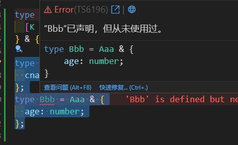
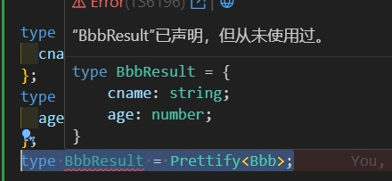

## 封装的高级类型

### Prettify

可以方便我们打印查看某个类型的key

封装：

```ts
type Prettify<T> = {
  [K in keyof T]: T[K];
} & {};
```

场景，比如下面代码

```ts
type Aaa = { cname: string; };
type Bbb = Aaa & { age: number; };
```

我们把鼠标移动到 `Bbb` 上，只能看出下面的信息，如果 `Aaa` 是在其他文件定义的，我们需要去找到对应文件的 `Aaa` 的才知道具体的key有哪些。



为了方便调试，我们可以用 `Prettify` 打印一下，加上下面代码

```ts
type BbbResult = Prettify<Bbb>;
```

鼠标再移入就可以清楚的看见有哪些key了



## Mutable

和 ts 内置的 `Readonly<T>` 作用相反，将所有的 readonly 改为允许读写

```ts
type Mutable<T> = {
  -readonly [P in keyof T]: T[P];
};t
```

例子：

```ts
interface A {
  readonly x: number;
  y?: number;
}

type T = Mutable<A>; // { x: number; y?: number | undefined; }
```

