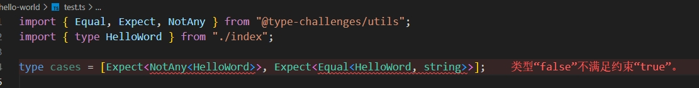

# 类型体操

该项目来自：[type-challenges](https://github.com/type-challenges/type-challenges/blob/main/README.zh-CN.md)


## 项目搭建

1、执行 `pnpm init` 初始化

2、执行 `pnpm i -D typescript` 和 `npx tsc --init` 初始化ts环境

3、安装依赖 `pnpm i -D @type-challenges/utils`

4、新建 `/src/hello-world/index.ts` 和 `/src/hello-world/test.ts`文件

```text
ts-learn
├── package.json
├── src
├── src
│   └── hello-world
│       ├── index.ts
│       └── test.ts
└── tsconfig.json
```

复制挑战中的 [hello-world/template.ts](https://github.com/type-challenges/type-challenges/blob/main/questions/00013-warm-hello-world/template.ts) 到 `/src/hello-world/index.ts` 中

复制挑战中的 [hello-world/test-cases.ts](https://github.com/type-challenges/type-challenges/blob/main/questions/00013-warm-hello-world/test-cases.ts) 到 `/src/hello-world/test.ts` 中

可以看到`test.ts`现在是报错状态



按照挑战完成对 `index.ts`的编写

```ts
// 原文
export type HelloWord = any;

// 改为下面内容
export type HelloWord = string;
```

可以看到 `test.ts` 的报错消失了