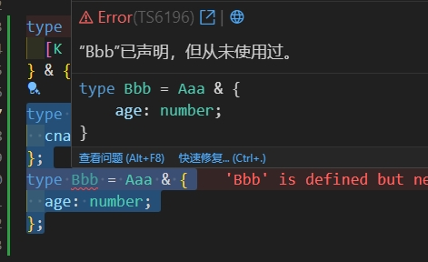

# 内置高级类型

ts中自带了一些高级类型，方便我们项目中使用

## 内置的类型

### Extract

`Extract<T, U>` 如果 `T` 是 `U` 中的类型则返回，不是则返回 never

比如：

```ts
type A = 'age' | 'name';
type B = 'like' | 'eat' | 'name';
type C = Extract<A, B>; // 结果C=name
```

**源码：**

```ts
type Extract<T, U> = T extends U ? T : never;
```

### Exclude

`Exclude<T, U>` 从 T 中挑出不属于 U 的类型。

例子：

```ts
type A = 'age' | 'like';
type B = 'like' | 'eat';
type C = Exclude<A, B>; // C=age
```

比如下面从一个联合类型中剔除某种类型的时候就很方便

```ts
type Shape = { kind: 'circle'; radius: number } | { kind: 'square'; x: number };
type Result = Exclude<Shape, { kind: 'circle' }>; // { kind: 'square'; x: number }
```

上面代码将一个联合类型，经过Exclude剔除掉带 `{kind: 'circle'}` 的属性后，就只剩下 `{ kind: 'square'; x: number }` 这个类型

**源码：**

```ts
type Exclude<T, U> = T extends U ? never : T;
```

> 解读：依次判断 `T` 是否在 `U` 内，是的话就不返回，不是的话就返回

### Record

```ts
type A = Record<'name' | 'age', string | number>;
const a: A = { name: 'name', age: 'age' };
```

**源码：**

```ts
type Record<K extends keyof any, T> = {
  [P in K]: T;
};
```

> 解读：

### Capitalize

首字母转大写

```ts
type A = Capitalize<'aabb'>; // A = Aabb
```

### Required

将对象的属性都变成必需的

```ts
interface Person {
  cname?: string;
  age?: number;
}

type A = Required<Person>; // {cname:string; age:number}
```

**源码：**

```typescript
type Required<T> = {
  [P in keyof T]-?: T[P];
};
```

> 解读：上面代码 `P in keyof T` 遍历了对象的属性，给每个属性加`-?`，`-?` 的含义是“删除问号”，

### Partial

将对象的属性变成可选

```ts
interface Person {
  cname: string;
  age: number;
}

type A = Partial<Person>; // 结果：{cname?:string; age?:number}
```

**源码：**

```typescript
type Partial<T> = {
  [P in keyof T]?: T[P];
};
```

> 解读：上面代码 `P in keyof T` 遍历了对象的属性，给每个属性加`?`，`?` 的含义是“加上问号”，

### Readonly

将数组或对象属性转为只读的

```ts
interface User {
  name: string;
  age: number;
}

let u: Readonly<User> = {
  name: 'xiaoming',
  age: 23,
};
u.age = 33; // 异常报错
```

### Pick

从类型中挑出一些属性，用 `Pick<T, U>`

```ts
type User = {
  name: string;
  age: number;
  gender: string;
};

type U = Pick<User, 'name' | 'age'>; // 得到 {name:string, age: number}
```

也可以从类上获取

```ts
class Person {
  name: string;
  age: number;
}

type PersonType = Pick<Person, 'name'>;
```

源码解读：
```ts
type Pick<T, K extends keyof T> = {
  [P in K]: T[P];
};
```
首先 `K extends keyof T` 约束了第2个参数都是第1个参数的key，接着`[P in K]`表示遍历K中所有键

### Omit

从类型中移除一些属性，用 `Omit<T,K>` 表示从 `T` 中取出移除 `K` 的其他所有属性

```ts
interface User {
  name: string;
  age: number;
  gender: string;
}
type U = Omit<User, 'age' | 'gender'>; // 得到 {name:string}
```

### NonNullable

去除类型中的 null 和 undefined，用 `NonNullable<T>`

```ts
type U = NonNullable<string[] | null | undefined>; // 得到 string[]
```

### Parameters

获取函数的参数类型所组成的元组类型

```ts
type U = Parameters<(a: number, b: string) => void>; // 得到 [number, string]
```

### ReturnType

获取函数的返回值类型

```ts
type Func = (a: string) => string;
type Aa = ReturnType<Func>; // 得到 string
```

### PropertyKey

用来简写object的key类型

例子：

```ts
type RecordWithAllKeys = Record<PropertyKey,unknown>;
```

上面的写法比 `Record<PropertyKey, unknow>` 好，这样key就限制在object key的允许范围类

**源码：**

```ts
type PropertyKey = string | number | symbol
```

### Awaited

可以提取 Promise 中的返回类型。

例子：

```ts
const result = Promise.resolve({name: 'xiaming', age: 23});
type Aaa = Awaited<typeof result>; // {name: 'xiaming', age: 23}
```

## 封装的一些ts高级类型

### Prettify

可以方便我们打印查看某个类型的key

封装：

```ts
type Prettify<T> = {
  [K in keyof T]: T[K];
} & {};
```

场景，比如下面代码

```ts
type Aaa = { cname: string; };
type Bbb = Aaa & { age: number; };
```

我们把鼠标移动到 `Bbb` 上，只能看出下面的信息，如果 `Aaa` 是在其他文件定义的，我们需要去找到对应文件的 `Aaa` 的才知道具体的key有哪些。



为了方便调试，我们可以用 `Prettify` 打印一下，加上下面代码

```ts
type BbbResult = Prettify<Bbb>;
```

鼠标再移入就可以清楚的看见有哪些key了

