# 初始rust

rust是强类型语言，不会自动转化数据类型。

## win的安装

从官网下载

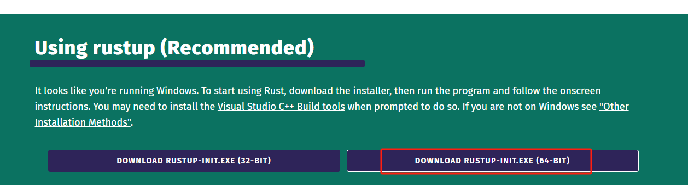

遇到下面的提示，我们选择 `1` 自动安装

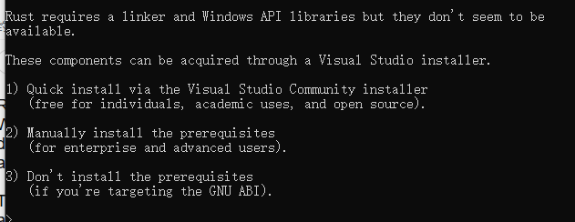

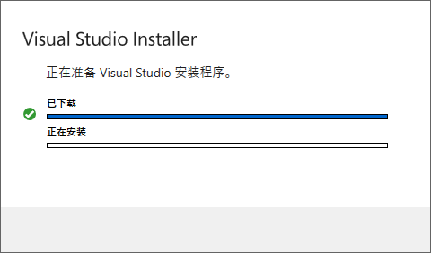

**可能遇到的错误：**

### 依赖visualstudio

```text
Rust Visual C++ prerequisites

Rust requires the Microsoft C++ build tools for Visual Studio 2017 or
later, but they don't seem to be installed.

You can acquire the build tools by installing Microsoft Visual Studio.

  https://visualstudio.microsoft.com/downloads/

Check the box for "Desktop development with C++" which will ensure that the
needed components are installed. If your locale language is not English,
then additionally check the box for English under Language packs.
```


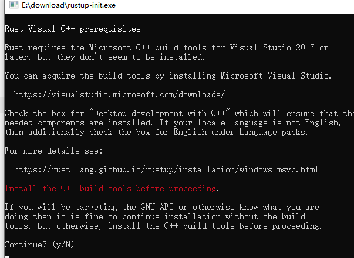

意思是rust需要我们提前安装 `Visual Studio`，前往[下载界面](https://visualstudio.microsoft.com/zh-hans/downloads/)，选择“社区版”

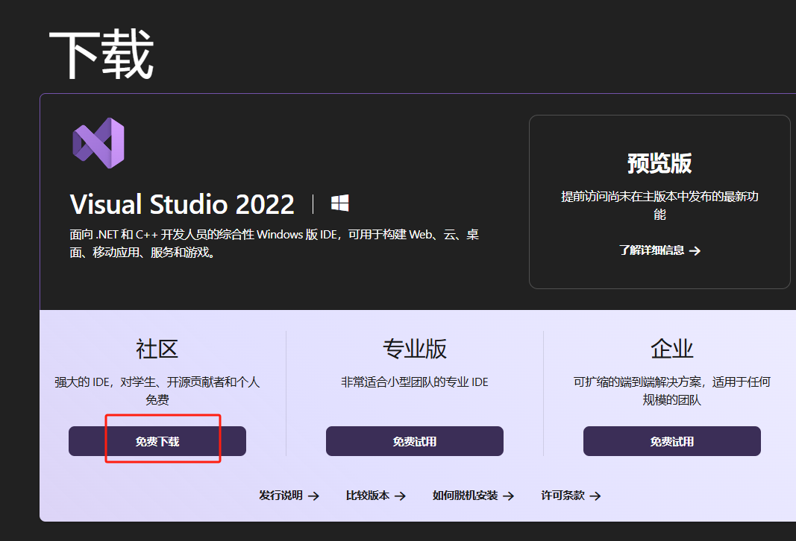

下载后双击安装即可，安装完成后，在电脑菜单中 `Visual Studio Installer`，注意不是 `Visual Studio 2022`。

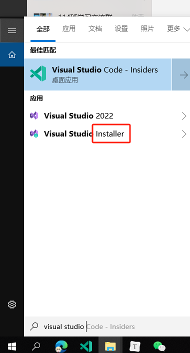

然后选择 `修改 - 工作负荷 - 勾选上《使用C++的桌面开发》`

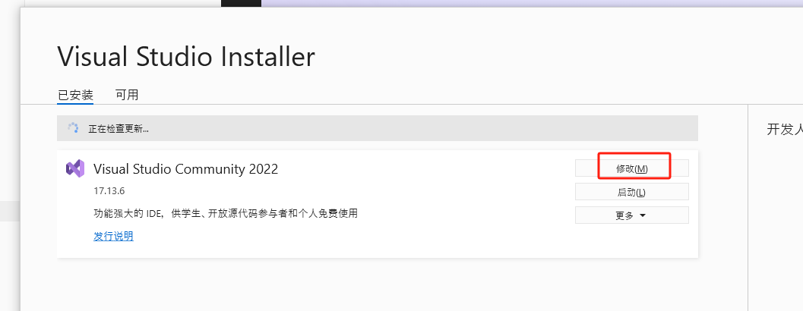

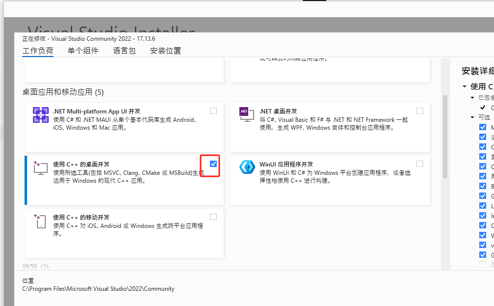

然后 `语音包 - 勾选《英语》`

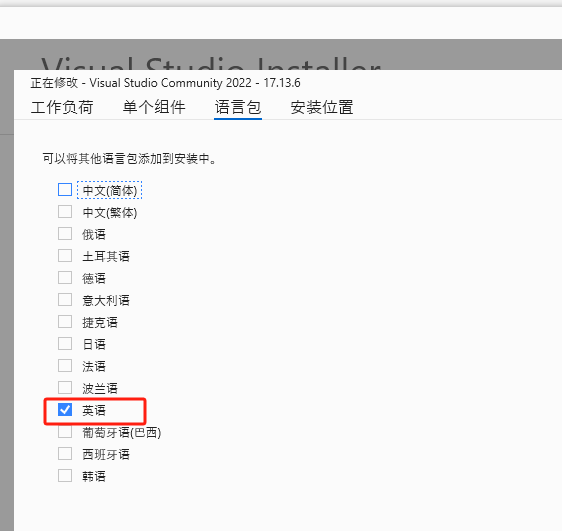

确认之后，会自动下载对应的插件包，等待安装完成
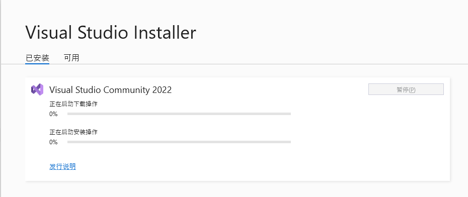

再重新安装 rust 的安装包 `rustup-init.exe` 就能看到正常的界面了

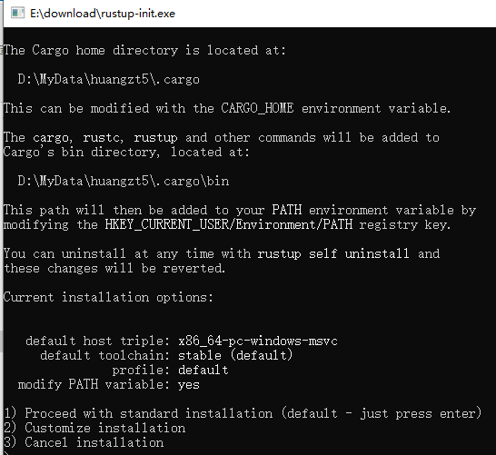

到这里按 `1` 继续安装，

### 电脑管理员权限问题

在公司电脑一直遇到这个下面这个错误

```text
error: could not create link from 'D:\MyData\xiaoming\.cargo\bin\rustup.exe' to 'D:\MyData\huangzt5\.cargo\bin\rust-analyzer.exe': 当文件已存在时，无法创建该文件。 (os error 183)
```

最后发现是权限问题，跟公司管理员申请特权权限模式，然后右键使用管理员运行

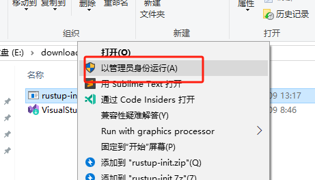

### 国内网络问题

接着遇到下面的错误信息

```text
info: profile set to 'default'
info: default host triple is x86_64-pc-windows-msvc
info: syncing channel updates for 'stable-x86_64-pc-windows-msvc'
error: could not download file from 'https://static.rust-lang.org/dist/channel-rust-stable.toml.sha256' to 'D:\MyData\xiaoming\.rustup\tmp\jg5i5_v0ia14udyy_file': failed to make network request: error sending request for url (https://static.rust-lang.org/dist/channel-rust-stable.toml.sha256): client error (Connect): tcp connect error: 由于连接方在一段时间后 没有正确答复或连接的主机没有反应，连接尝试失败。 (os error 10060): 由于连接方在一段时间后没有正确答复或连接的主机没有反 应，连接尝试失败。 (os error 10060)
```

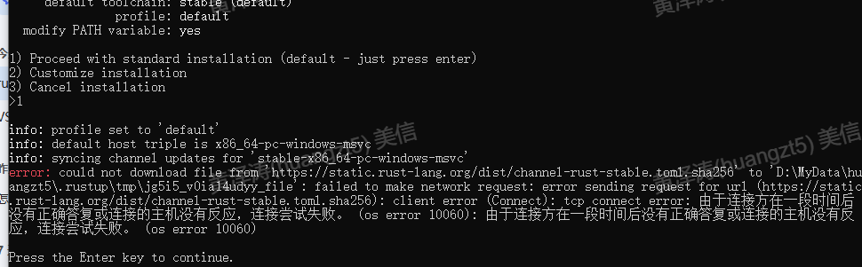

这个是国内环境没法链接rust下载，需要使用国内的镜像，[参考文章](https://www.sunzhongwei.com/windows-11-install-rust-with-china-mirror) 的方法

在空白的地方，按下 `shift + 鼠标右键` 启动shell，设置下面信息

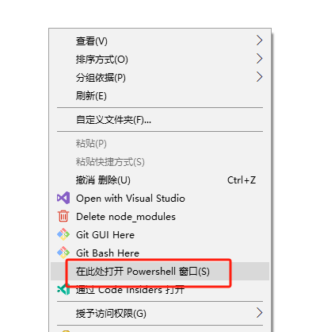

```shell
$ENV:RUSTUP_DIST_SERVER='https://mirrors.ustc.edu.cn/rust-static' 
$ENV:RUSTUP_UPDATE_ROOT='https://mirrors.ustc.edu.cn/rust-static/rustup'
```

然后还是继续在这个 Powershell 窗口（因为上面的配置是临时性的）,可以看到下面已经从国内镜像的url下载了

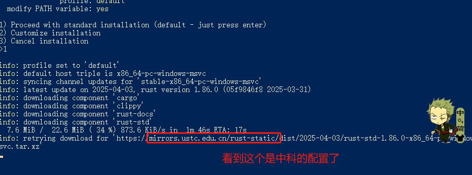

这样看到下面内容就是安装成功了

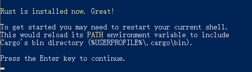

### 验证安装成功

在 cmd 中执行下，看到内容即可。

```shell
rustc --version
cargo --version
```


