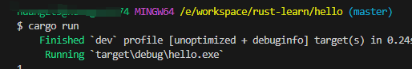

# 创建项目

在 cmd 执行 `cargo new <项目名称>` 即可创建

```text
├───📁 src/
│   └───📄 main.rs
├───📄 .gitignore
├───📄 Cargo.lock
└───📄 Cargo.toml
```

执行 `cargo run` 会自动编译然后执行看到结果



接着执行 `cargo build` 可以看到下面结果说明构建成功

```text
E:\workspace\rust-learn\hello>cargo build
   Compiling hello v0.1.0 (E:\workspace\rust-learn\hello)
    Finished `dev` profile [unoptimized + debuginfo] target(s) in 1.53s
```

构建的结果放在 `./target/debug/hello.exe` ，在cmd执行

```shell
cd target\debug
hello.exe
```


如果执行 `carge build --release` 将打包出更小体积的包（去掉了debug信息）生成在 `./target/release` 目录中。

