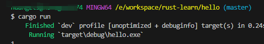
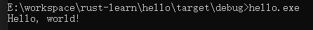

# 认识cargo

cargo是rust的包管理器，类似node中的npm的作用。

### 创建项目

在 cmd 执行 `cargo new <项目名称>` 即可创建

```text
├───📁 src/
│   └───📄 main.rs
├───📄 .gitignore
├───📄 Cargo.lock
└───📄 Cargo.toml
```

### 运行项目

执行 `cargo run` 会自动编译然后执行看到结果



### 构建项目

接着执行 `cargo build` 可以看到下面结果说明构建成功

```text
E:\workspace\rust-learn\hello>cargo build
   Compiling hello v0.1.0 (E:\workspace\rust-learn\hello)
    Finished `dev` profile [unoptimized + debuginfo] target(s) in 1.53s
```

构建的结果放在 `./target/debug/hello.exe` ，在cmd执行

```shell
cd target\debug
hello.exe
```



如果执行 `carge build --release` 将打包出更小体积的包（去掉了debug信息）生成在 `./target/release` 目录中。

### 快速检查

当项目大了后，`cargo run` 和 `cargo build` 不可避免的会变慢，这个时候就需要 `cargo check`

`cargo check` 它的作用很简单：快速的检查一下代码能否编译通过。因此该命令速度会非常快，能节省大量的编译时间

### Cargo.toml

记录了项目的meta元数据，

```toml
[package]
name = "hello"
version = "0.1.0"
edition = "2024"

[dependencies]
```

- `name`：项目名称
- `version`：定义当前版本
- `edition`：定义了我们使用的 Rust 大版本，[rust版本说明](https://course.rs/appendix/rust-version.html)

### Cargo.lock

