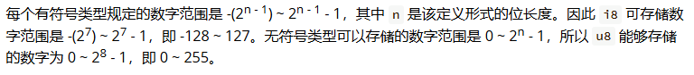

# 整数和浮点数类型

## 整数

整数类型有下面几种

* 无符号（unsigned）整数：`u8`、`u16`、`u32`、`u64`、`usize`，表示数字只能取正数或0。
* 有符号（signed）整数：`i18`、`i16`、`i32`、`i64`、`isize`，表示数字可以取正数或0或负数。

其中 `usize / isize` 是跟电脑有关系的，如果电脑是 x64位 的，那么 `usize / isize` 就是64位，如果电脑是 x32 位，那么 `usize / isize` 就是32位。



```rust
let a = 22;      // 自动推导是i32
let b: i32 = 22; // 明显写出类型
let c = 22i32;   // 通过类型后缀的方式进行类型标注
let d = 22_i32;  // 也可以使用 `_类型` 的书写方式
```

在书写的时候，我们可以用 `_` 给数值加上分隔符，提高代码的可读性

```rust
let a = 1_000_000; // 其实就是1000000
```

## 浮点数

浮点数有下面几种：

* 32位单精度浮点数：`f32`
* 64位双精度浮点数：`f64`，如果什么都不写，默认就是这个

```rust
let a = 1.0; // 自动推导 f64 类型
let a: f32 = 2.0;
```

## 序列

rust提供了一个简洁的方式生成连续的数值，例如 `1..5`，生成从 1 到 4 的连续数字，不包含 5 ；`1..=5`，生成从 1 到 5 的连续数字，包含 5，

它的用途很简单，常常用于循环中：

```rust
for i in 1..=5 {
    println!("{}",i);
}
// 最终输出 1 2 3 4 5
```

序列只允许用于数字或字符类型，原因是：它们可以连续，同时编译器在编译期可以检查该序列是否为空，字符和数字值是 Rust 中仅有的可以用于判断是否为空的类型。如下是一个使用字符类型序列的例子：

```rust
for i in 'a'..='z' {
    println!("{}",i);
}
```

