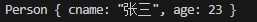
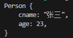

# 宏

## print 和 println

- `print!()`：打印信息，结尾不会换行
- `println!()`：打印信息，结尾会换行

可以按照大括号中的位置取值

```rust
let a = 9;
let c = a * a;
println!("{0} * {0} = {1}", a, c)
```

上面的 `{0}` 和 `{1}` 指的去对应位置的内容展示，这样就可以精简一下写法。

对于结构体的打印，需要使用 `{:?}` 或 `{:#?}` 打印

```rust
#[derive(Debug)]
struct Person {
  cname: String,
  age: i32
}

let p = Person {
  cname: String::from("张三"),
  age: 23
};
print!("{:#?}", p)
```

`"{:?}"` 打印出来的如下



`"{:#?}"` 打印出来的如下，比上面的更加直观



目前需要这种打印方式的有

- 结构体
- 元组

