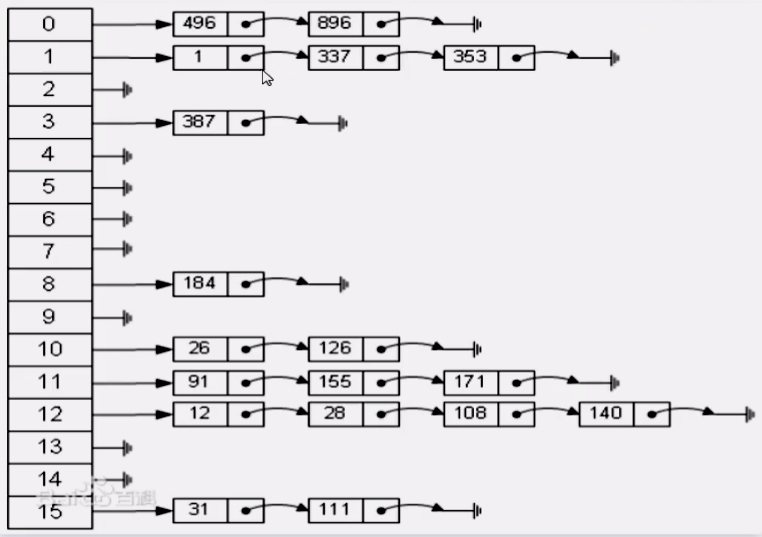

# hashMap

HashMap由链表+数组组成，它的底层结构是一个数组，而数组的元素是一个单向链表，存储的是 `key-value` 的键值对



HashMap的键可以是布尔型、整形、字符串，或任意实现了 `Eq` 和 `Hash trait` 的其他类型。

```rust
let mut my_hash_map = HashMap::new();
my_hash_map.insert("小明", 12);
my_hash_map.insert("小红", 13);
println!("{:?}", my_hash_map); // {"小红": 13, "小明": 12}
```

## HashMap的API

- `get()`：根据某个key取值，返回的是一个 `Option`，可以和 `match` 搭配使用

```rust
let mut my_hash_map = HashMap::new();
my_hash_map.insert("小明", 12);

match my_hash_map.get("小明") {
  Some(age) => println!("年龄是 {}", age),
  None => println!("找不到人")
}
```

- `for .. in into_iter()`：遍历HashMap

```rust
let mut my_hash_map = HashMap::new();
my_hash_map.insert("小明", 12);
my_hash_map.insert("小红", 2);

for item in my_hash_map.into_iter() {
  println!("{}, {}", item.0, item.1)
}
```

- `remove()`：删除某个key

```rust
let mut my_hash_map = HashMap::new();
my_hash_map.insert("小明", 12);
my_hash_map.insert("小红", 2);
println!("{:?}", my_hash_map);

my_hash_map.remove("小明");
println!("{:?}", my_hash_map);
```

