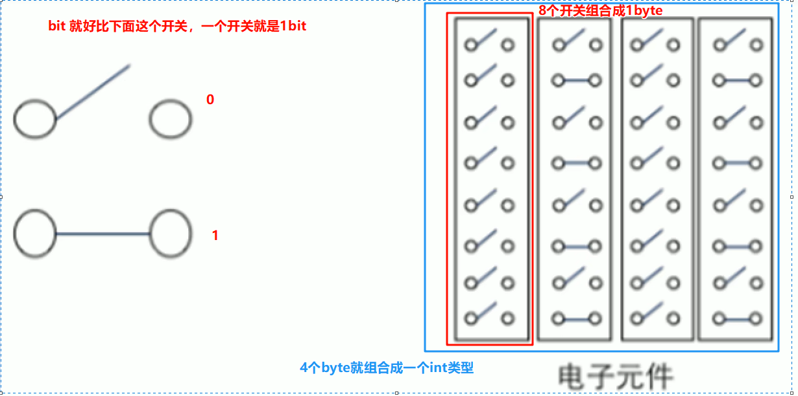
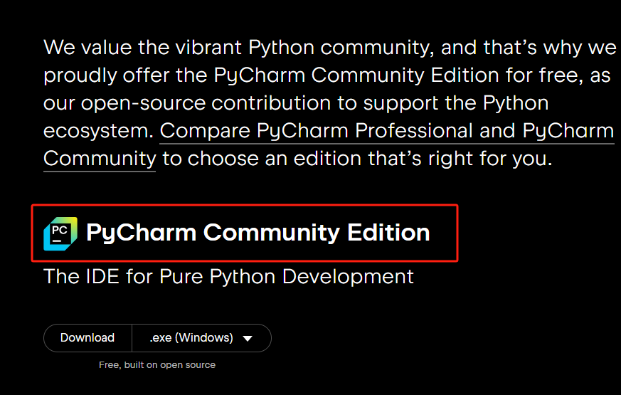

# 入门

## 计算机基础

计算机只能识别二进制指令，如 `01010100101111000...`，这样的一位 `0 或 1` 我们称为 `bit 比特位`。8个bit就组合成1个 `byte 字节`，而4个byte组合成一个int类型，所以1个int是32个byte

| 单位              | 单位    |
| ----------------- | :------ |
| 1 byte（也是 1B） | 8 bit   |
| 1 KB              | 1024 B  |
| 1 MB              | 1024 KB |
| 1 GB              | 1024 MB |
| 1 TB              | 1024 GB |
|                   |         |

## win的安装

访问 [python官网](https://www.python.org/downloads/) 下载最新的python（也称python解析器）

前往 [www.jetbrains.com](https://www.jetbrains.com/pycharm/download/?section=windows#section=windows) 下载 pychrm，也就是开发python的编辑器，我们选择社区版下载即可，专业版收费，但是社区版已经满足我们日常开发了

