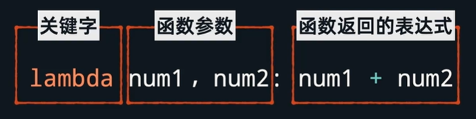

# 函数

定义函数的格式如下：

```python
def <函数名>(参数1，参数2):
  # 函数的实现，如果需要返回则用return关键词
```

如果没有return，函数默认返回 `return None`

### 高阶函数

函数接收另外一个函数作为参数，称为高阶函数

比如我们开发一个计算方法，根据不同type，计算公式不同

```python
def cal_result (a, b, type):
  if type == '01':
    result = a + b
  elif type == '02':
    result = a * b
  else:
    result = a / b
  print("计算结果："+ str(result))
```

如果type一直出新的需求，这个公式将变得很长，我们可以把计算的逻辑抽离出去，作为参数传递给 `cal_result()` 

```python
def sum(a, b):
  return a+ b

def multiply(a, b):
  return a * b

def division(a, b):
  return a / b

def cal_result(a, b, method):
  result = method(a, b)
  print("计算结果："+ str(result))

cal_result(1, 2, sum) // 需要计算+的就传sum方法
cal_result(1, 2, multiply) // 需要计算*的就传multiply方法
```

上面的 `cal_result` 就称为高阶函数

### 匿名函数

有时候，我们在高阶函数中，传递给参数的函数很简单，就1行代码，还要想着为其其一个名字比较费事，就可以使用匿名函数

格式：`lambda 参数1,参数2: 逻辑`，但匿名函数只能有一个逻辑语句。



比如上面的代码：

```python
def sum(x, y):
  return x + y

def multiply(x, y):
  return x * y

def cal_result(a, b, method):
  result = method(a, b)
  print("计算结果："+ str(result))
  
######## 我们可以用匿名函数简写
def cal_result(a, b, method):
  result = method(a, b)
  print("计算结果："+ str(result))
  
cal_result(1, 2, lambda x,y:x + y)
cal_result(1, 2, lambda x,y:x * y)
```

匿名函数除了直接作为参数，还可以自执行。

书写格式：`(lambda 参数1,参数2: 逻辑)(实参1，实参2)`，例如下面代码：

```python
(lambda x:print(x))('xiaoming')
```


