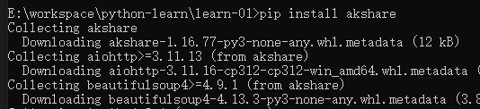

# 模块的引入

模块通过 `import` 方式引入，具体有以下几种写法：

写法1：`import  <模块>`，这种会直接引入模块的所有方法，通过 `<模块名>.<方法>` 的方式去调用

```python
import statistics

statistics.median([19,-9,34]) # 求中位数
statistics.mean([19,-9,34]) # 求平均值
```

写法2：`from <模块> import <方法1>,<方法2>`，按需引入需要的方法

```python
from statistics import median, mean

median([19,-9,34]) # 求中位数
mean([19,-9,34]) # 求平均值
```

写法3：`from <模块> from *`，和写法1类似，将某个模块全量引入

```python
from statistics import *

median([19,-9,34]) # 求中位数
mean([19,-9,34]) # 求平均值
```

## 第3方库的引入

第3方库存在 [官网](https://pypi.org/)，类似js的 npm官网。

下面以 [akshare](https://pypi.org/project/akshare/) 这个库为例子

首先我们需要在 cmd 执行 `pip install akshare`

