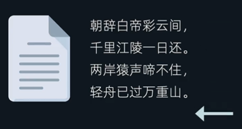

# 文件操作

要读写文件，需要先打开文件，通过 `open(<文件>, <读写模式>, <用什么编码格式读取>)`，该方法返回一个文件对象，通过文件对象可以对文件进行操作。

读文件，如果传递的路径不存在则会报错

读写模式有这几个配置：`r（只读）` / `w（只写）` / `a(追加写入)` / `r+(读写)`，如果不写则默认只读模式。

```python
file = open('./song.txt', 'r', encoding="utf-8")
```

### 读默认

```python
file = open('./song.txt', 'r', encoding="utf-8")
file.read()   # 一次性读完所有内容
file.close()  # 读取后要关闭下文件对象，释放资源
```

* `read(<字节数>)`：按照指定的字节数读取文件，如果不传递参数，则读取整个文件内容

`read()` 会记录上次读取后的指针位置，再次调用的时候，就会往指针位置继续读取

```python
# song.txt 原文如下
朝辞白帝彩云间
千里江陵一日还
两岸猿声啼不住
轻舟已过万重山


###############
print(file.read(5)) # 朝辞白帝彩
print("---------")
print(file.read(5)) # 云间\n千里
```

因此，如果多次调用 `read()` 会发现第2次的内容是空的

```python
file = open('./song.txt', 'r', encoding="utf-8")
print(file.read())
print("---------")
print(file.read()) # 第2行已经读取了整个文件，指针已经指向最后，再读取就是空字符串
```



> 使用 `read()` 记住不要去读取大文件，会把内存撑爆

* `readline()`：每次调用会读取一行，再次调用继续读取下一行，文件结束那就返回空字符串，我们可以使用 `while` 循环来判断是否读取完成

```python
f = open('./song.txt', 'r', encoding="utf-8")
content = f.readline()
while content != "": # 如果是空字符串说明到了文件最后
  print(content)
  content = f.readline()
```

* `readlines()`：读取整个文件，但是返回的是一个数组，每一行都会作为数组的一个元素。然后我们就可以用 `for循环` 遍历得到每一行的内容。

```python
f.readlines() # ['朝辞白帝彩云间\n', '千里江陵一日还\n', '两岸猿声啼不住\n', '轻舟已过万重山']
```

> 通过 `open()` 打开文件，操作完后要调用下 `close()` 关闭操作释放内存
>
> 如果不想手动调用 `close()`，可以通过下面写法
>
> ```python
> with open('./song.txt', 'r', encoding="utf-8") as file:
>   print(file.read())
> ```
>
> 即
>
> ```python
> with open() as <变量>:
>   # 文件操作（缩进的代码执行结束后就会自动断开文件释放内容）
> ```


### 写默认

写文件，如果传递的文件路径不存在，则会自动创建改文件。

如果我们传给 `open()` 的是 `w` 模式，则写文件的时候，如果文件原本就有内容，会清空内容再写入，因此这点需要注意

```python
with open('./song.txt', 'w', encoding="utf-8") as file:
  file.write("hello")
  file.write("world")
```

如果我们只是想要在原内容的后面追加，则应该传 `a` 模式

```python
with open('./song.txt', 'a', encoding="utf-8") as file:
```


## 读写模式

使用读写模式的好处，既可以对文件读取，又可以对文件写操作。这种方式容易对指针误导

比如下面代码

```python
# song.txt 原文如下
1231231232313123是的发送到发送到

with open('./song.txt', 'r+', encoding="utf-8") as file:
  file.write("hello2\n")
  file.write("world")
```

上面执行结果，`song.txt` 内容变成下面：

```txt
hello2
world123是的发送到发送到
```

这是因为刚 `open()` 的时候，指针是在文件的首位置，因此从文件首位置开始写内容

如果我们改下代码变成下面的：

```python
with open('./song.txt', 'r+', encoding="utf-8") as file:
  file.read();
  file.write("hello2\n")
  file.write("world")
```

那么内容就变成了

```text
1231231232313123是的发送到发送到hello2
world
```

这是因为 `read()` 读取文件之后，指针会停留在文件最后位置，那么再执行 `write()` 操作，是从指针位置开始，也就是最后位置开始写。


