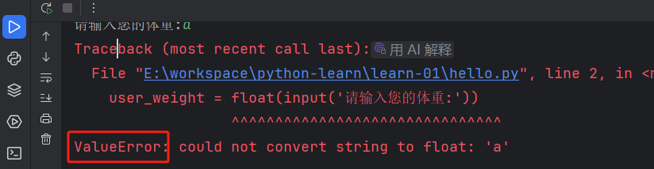
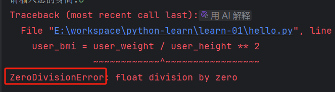

# 异常捕获

捕获异常的写法：

```python
try:
  # 代码
except: 集体的异常
  # 异常
except: 
  # 任何异常
else:
  # 正常继续运行
finally:
  # 异常和正常都会执行
```

比如我们让用户输入身高+体重，计算BMI指标

```python
user_weight = float(input('请输入您的体重:'))
user_height = float(input('请输入您的身高:'))
user_bmi = user_weight / user_height ** 2
```

那么可能出现这种异常，用户输入的是字符串导致代码报错如下：

```text
    user_weight = float(input('请输入您的体重:'))
                  ^^^^^^^^^^^^^^^^^^^^^^^^^^^^^^^
ValueError: could not convert string to float: 'a'
```



因此我们可以去捕获这个 `ValueError` 的异常

如果用户输入的身高是0，0是不能作为除数的，会出现这个报错



然后可能还有其他异常，我们就统一提示 “未知错误”

```python
try:
  user_weight = float(input('请输入您的体重:'))
  user_height = float(input('请输入您的身高:'))
  user_bmi = user_weight / user_height ** 2
except ValueError:
  print('请输入数字')
except ZeroDivisionError:
  print('0不能作为除数')
except:
  print('未知错误')
else:
  print('您的BMI='+str(user_bmi))
finally:
  print('程序结束')
```

`except` 是从上到下匹配，匹配中了就不继续匹配了

