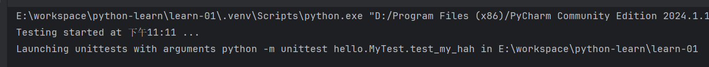

# 单测

一般需要用到 `unittest` 这个内置的库。比如现在 `tool.py` 代码如下：

```python
def sum (a, b, operator):
  if operator == '+':
    return a + b
  else:
    return a - b
```

那么单测的格式，单测文件名必须以`test_` 开头：

```python
import unittest
from tool import sum

# 类名随意，但是需要继承 unittest.TestCase
class MyTest(unittest.TestCase):
  def test_my_sum(self): # 方法名随意，但是需要以 `test_` 开头
    self.assertEqual(sum(1, 2, '+'), 3)
  def test_my_hah(self):
    self.assertEquals(sum(3, 4, '-'), -1)
```

然后在 cmd 中执行 `python -m unittest`

unittest 会自动去找所有继承了 `unittest.TestCase` 的类，然后方法名是 `test_` 开头的，执行其中的单测代码。



### 常见的断言

常用的断言 API 如下：

* `assertEqual(A, B)`：断言 A = B，对应的反向是 `assertNotEqual()`
* `assertTrue(A)`：断言 A 为真，对应的反向是 `assertFalse()`。
* `assertIn(A, B)`：断言 A 在 B中，比如 `assertIn(2, [1,2,3])`，对应的反向是 `assertNotIn()`

## 钩子

* `setUp()` 每次跑 `test_xxx` 单测方法之后，都会调用调用 `setUp()`  方法

比如 `tool.py` 有代码如下：

```python
class Stu:
  def __init__(self, name):
    self.name = name
    
  def say(self, content):
    return f"{self.name}说：{content}"
```

我们就可以这么写单测：

```python
import unittest
from tool import Stu

class MyTest(unittest.TestCase):
  def setUp(self):
    print('小----')
    self.s = Stu("小明")
  def test_my_sum(self):
    self.assertEqual(self.s.say("您好"), "小明说：您3好")
  def test_my_hah(self):
    self.assertEqual(self.s.say("Hello"), "小明说：Hello")
```

执行可以发现出了2次 `小----`，对应了2次 `def test_` 的方法