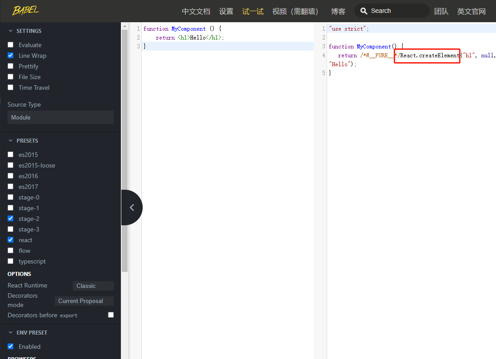

# 001-开发工具

* chrome扩展工具: [【react developer tools】](https://chrome.zzzmh.cn/info?token=fmkadmapgofadopljbjfkapdkoienihi)

* [babel在线试一试](https://www.babeljs.cn/repl#?browsers=defaults%2C%20not%20ie%2011%2C%20not%20ie_mob%2011&build=&builtIns=false&spec=false&loose=false&code_lz=Q&debug=false&forceAllTransforms=false&shippedProposals=false&circleciRepo=&evaluate=false&fileSize=false&timeTravel=false&sourceType=module&lineWrap=true&presets=env%2Creact%2Cstage-2&prettier=false&targets=&version=7.12.14&externalPlugins=): 在线可以查看jsx转为js后的样子

