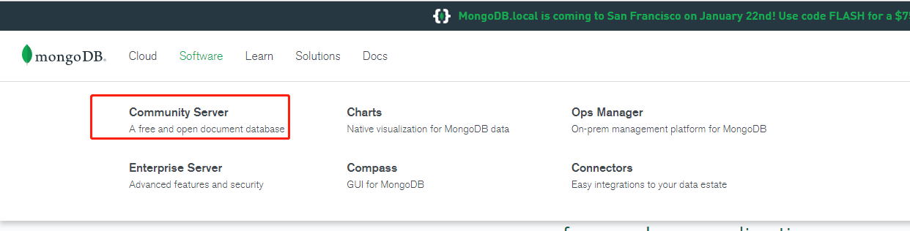
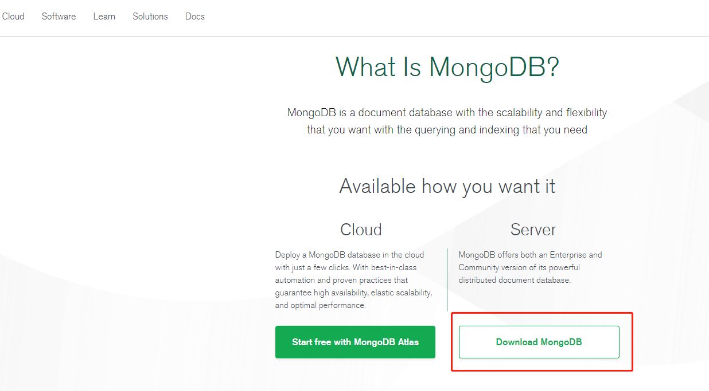
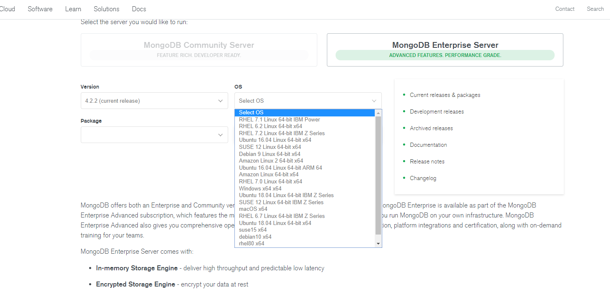
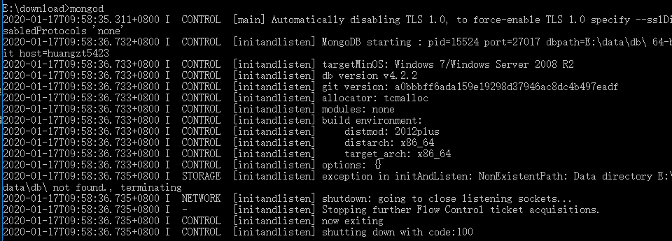
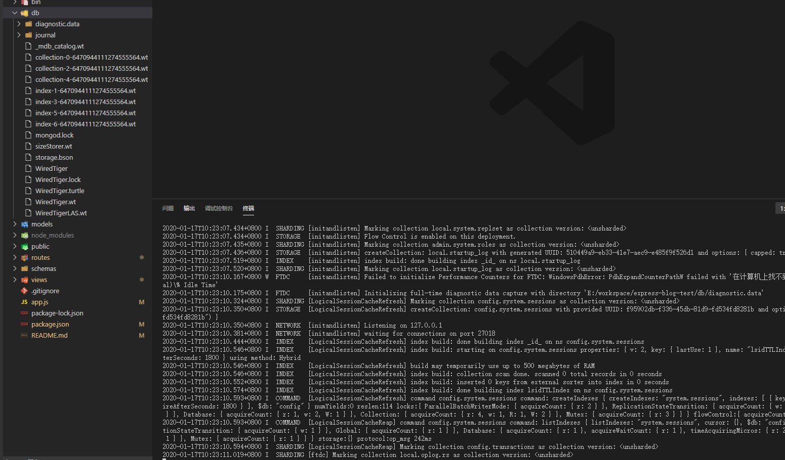
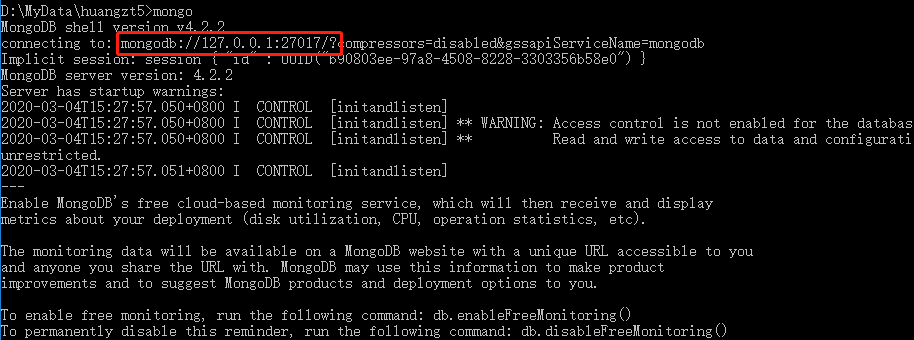
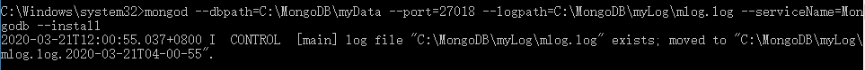
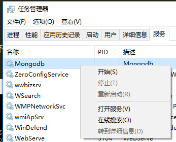
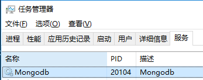

# 001-在win的安装

## 1、下载
[mongodb官网](https://www.mongodb.com/)

我们下载社区免费版就够了，然后根据操作系统选择对应的稳定版本








## 2、安装
下载好的双击一直下一步即可

在安装的目录中找到bin文件夹，将其添加到电脑的环境变量上。这样就可以在cmd任意访问

cmd执行`mongod`看到下面界面说明配置成功




## 3、启动
执行 `mongod --dbpath=C:\MongoDB\myData --port=27017`

* --dbpath 要在哪个文件夹创建数据库
* --port 要用什么端口启动，默认27017




过后如果忘记端口了，想要查看可以执行`mongo`，得到下面结果:



> mongod是服务端命令，用来启动暂停服务之类。 mongo是客户端命令，在服务端启动后可以用客户端命令增删改查等操作

上面的`mongod --dbpath=E:\workspace\express-blog-test\db --port=27018`启动的是临时服务，如果cmd停掉或者关闭，则mongodb服务跟着停止

所以需要做下面的步骤，把mongod注册为一个服务，每次开机自动启动


## 4、注册window服务
如果想要启动一个支持的服务，可以加上参`--serverName`，如果想要打上日志可以加参数`--logpath`

比如执行下面代码（需要用管理员运行cmd才有权限）:
```
mongod --dbpath=C:\MongoDB\myData --port=27017 --logpath=C:\MongoDB\myLog\mlog.log --serviceName=Mongodb --install
```
这条命令会往window服务上注册名为`Mongodb`的服务，启动提示如下:



注册成功后，需要自己再去`任务管理器-服务查看`启动下



现在关闭了cmd，mongodb也会运行在后台，可以通过




## 5、删除window服务
首先要把服务停掉，然后用管理员执行下面命令

```shell
sc delete Mongodb
```
