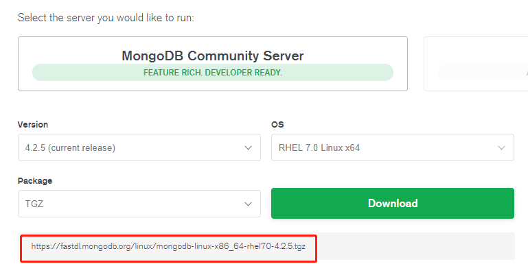
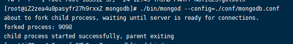
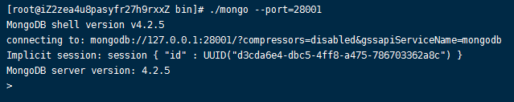
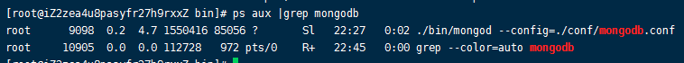

# 003-在centos的安装


## 1、下载
在官网上没有centos版的，选择RHEL版，和centos同家公司的产品。



复制下载链接，在Centos上执行下载命令
```shell
wget https://fastdl.mongodb.org/linux/mongodb-linux-x86_64-rhel70-4.2.5.tgz
```

## 2、安装
```shell
# 解压
tar -zxvf mongodb-linux-x86_64-rhel70-4.2.5.tgz

# 把解压后的mongodb剪切到本地的local文件夹，并且重命名为mongodb
mv mongodb-linux-x86_64-rhel70-4.2.5/ /usr/local/mongodb

# 文件夹重命名
mv mongodb-linux-x86_64-rhel70-4.2.5 mongodb

# 进入mongodb文件夹
cd mongodb/

# 创建data、logs、conf文件夹用来存放数据和日志
mkdir data
mkdir logs
mkdir conf

# 进入conf，创建mongodb.conf文件
cd conf/
touch mongodb.conf

# 设置配置，内容如下
vim mongodb.conf
```

`mongodb.conf`配置内容：
```
dbpath=/usr/local/mongodb/data
logpath=/usr/local/mongodb/logs/mongodb.log
port=28001
bind_ip=0.0.0.0
logappend=true
fork=true
auth=true
```

* `bind_ip=0.0.0.0` 的作用是设置所有IP都可以连接mongodb，如果设置成`127.0.0.1`的话，就只能在服务器本地访问，其他地方（比如window通过可视化工具）无法连接上

进入bin，执行mongod，并且让其去读取之前我们写好的配置
```shell
cd ../bin/

./mongod --config=../conf/mongodb.conf
```



验证：执行bin下的mongo命令，因为我们之前配置文件里面指定了`port=28001`，所以执行mongo命令也需要指定那个端口，能进入控制台说明安装完成
```shell
./mongo --port=28001
```




也可以通过`ps aux |grep mongodb`查看进程


