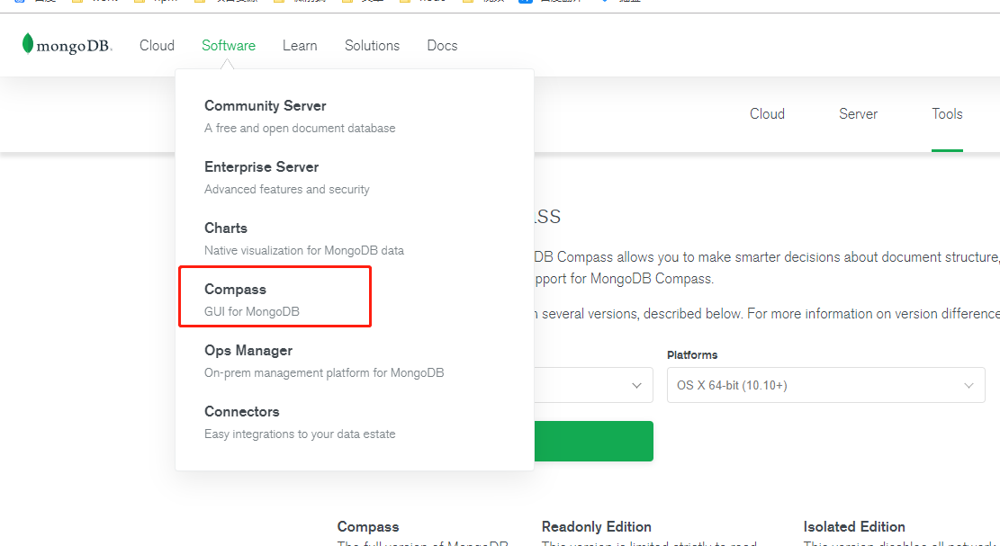
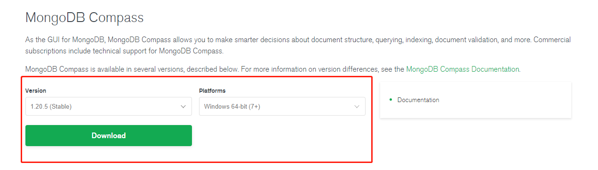

# 003-在centos的安装

## 1、下载
在[官网](https://www.mongodb.com/try/download/community)上没有centos版的，选择RHEL版，和centos同家公司的产品。


复制下载链接，在Centos上执行下载命令
```shell
wget https://fastdl.mongodb.org/linux/mongodb-linux-x86_64-rhel70-4.2.5.tgz
```

## 2、安装
```shell
# 解压
tar -zxvf mongodb-linux-x86_64-rhel70-4.2.5.tgz

# 把解压后的mongodb剪切到本地的local文件夹，并且重命名为mongodb
mv mongodb-linux-x86_64-rhel70-4.2.5/ /usr/local/mongodb

# 进入mongodb
cd /usr/local/mongodb

# 创建data、logs、conf文件夹用来存放数据和日志
mkdir data
mkdir logs
mkdir conf

# 进入conf，创建mongodb.conf文件
cd conf/
touch mongodb.conf

# 设置配置，内容如下
vim mongodb.conf
```

`mongodb.conf`配置内容：
```
dbpath=/usr/local/mongodb/data
logpath=/usr/local/mongodb/logs/mongodb.log
port=28001
bind_ip=0.0.0.0
logappend=true
fork=true
auth=false
```

* `bind_ip=0.0.0.0`: 的作用是设置所有IP都可以连接mongodb，如果设置成`127.0.0.1`的话，就只能在服务器本地访问，其他地方（比如window通过可视化工具）无法连接上
* `fork=true`: 设置后台运行
* `auth=true`: 开启认证服务，为了方便远程无密码连接先设置false


## 3、启动服务端服务
进入bin，执行mongod，并且让其去读取之前我们写好的配置
```shell
cd ../bin/

./mongod --config=../conf/mongodb.conf
```


可以通过`ps aux |grep mongodb`查看进程


## 4、启动客户端验证
验证：执行bin下的mongo命令，因为我们之前配置文件里面指定了`port=28001`，所以执行mongo命令也需要指定那个端口，能进入控制台说明安装完成
```shell
./mongo --port=28001
```


## 5、配置全局环境变量
通过上面的方式配置的`mongo/mongod`，每次需要进入到`/usr/local/mongodb-4.4.3/bin` 才能执行`mongo/mongod命令`

如果觉得麻烦，可以把改bin目录配置到环境变量里面，这样在任何目录都可以自行

```shell
vim /etc/profile
```

在最后面添加
```
MONGO_HOME=/usr/local/mongodb-4.4.3/bin
export PATH=$MONGO_HOME:$PATH
```

然后重启
```shell
source /etc/profile
```


这样就可以随时执行nginx命令了
```shell
mongod --help # mongod
mongo --help # mongo
```


## 6、关闭mongodb
执行`killall mongod`


## 7、远程连接
新版的mongodb据说默认集成了，如果没有看到的的话可以用下面的方式自己安装，[compass下载链接](https://www.mongodb.com/download-center/compass)



选择需要的平台下载



推荐wind下载zip，用exe的没有让我们选择安装路径，都不知道装到哪儿了。用zip的解压即可运行

