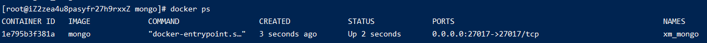
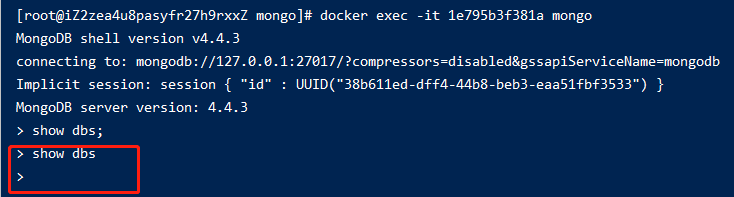
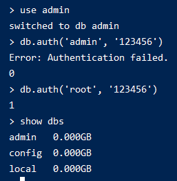

# 005-在docker的安装

这里是docker-compose安装的mongo服务

1. 编写`docker-compse.yml`
```yml
version: "3.1"
services:
  mongo:
    container_name: xm_mongo
    image: mongo
    restart: always
    environment:
      MONGO_INITDB_ROOT_USERNAME: root
      MONGO_INITDB_ROOT_PASSWORD: 123456
    ports:
      - 27017:27017
    volumes:
      - /root/svr/mongo/data:/data/db
```

执行下面命令启动镜像
```shell
docker up -d
```



2. 进入容器查询数据
首先执行下面命令，进入容器镜像
```shell
# 1e795b3f381a为容器镜像
docker exec -it 1e795b3f381a mongo
```
这个时候虽然进入了mongo的客户端，连接上了数据库，但是无法查询任何数据


需要执行下面命令登录下账号
```shell
use admin
# admin/123456 是启动容器时候设置的密码
db.auth('admin', '123456')

# 登录成功就有权限查询数据了
show dbs
```
