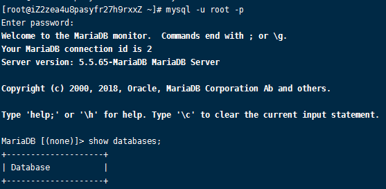
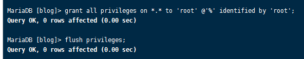

# 003-在centos安装

centos7以后已经不支持mysql，需要使用替换品maria DB


## 1、在centos上安装mariaDB

[mariaDB安装教程](https://blog.csdn.net/qq_26903797/article/details/104709596)

执行`mysql -u root -p`，无需密码即可进入mysql服务




## 2、远程连接mariaDB
使用mysql可视化工具访问的时候，一直访问失败，可以按照下面进行排查
1. 阿里云服务器是否开启3306端口访问出入
2. mysql数据库默认不支持远程连接，需要进入mysql命令行后执行下面代码
```
grant all privileges on *.* to 'root'@'%' identified by 'root';
flush privileges;
```

3. 因为mariaDB按照后默认root不用密码，但是远程连接必须用密码。我们进入mysql命令行
```
use mysql;

UPDATE user SET password=password('123456') WHERE user='root'; // 设置密码

flush privileges; // 刷新mysql
```
这样子用`root/123456`去登陆既可以了


## 2、mariaDB存中文乱码
[解决方法](https://blog.csdn.net/bon_mot/article/details/78677313)

1. 修改`client.cnf`配置
```shell
vim /etc/my.cnf.d/client.cnf
```
找到`[client]`的地方，新加配置`default-character-set=utf8`，如下:
```conf
[client]
default-character-set=utf8
```


2. 修改`server.cnf`配置
```shell
vim /etc/my.cnf.d/server.cnf
```
找到`[mysqld]`的地方，新加配置如下:
```conf
[mysqld]
init_connect = 'SET collation_connection = utf8_general_ci'
init_connect = 'SET NAMES utf8'
character_set_server = utf8
collation_server = utf8_general_ci

[mysqld_safe]
init_connect = 'SET collation_connection = utf8_general_ci'
init_connect = 'SET NAMES utf8'
character_set_server = utf8
collation_server = utf8_general_ci
```

3. 重启服务
```shell
systemctl restart mariadb.service
```

4. 在进入mysql，执行`SHOW VARIABLES LIKE 'character%';`查看下字符集都是utf8了
