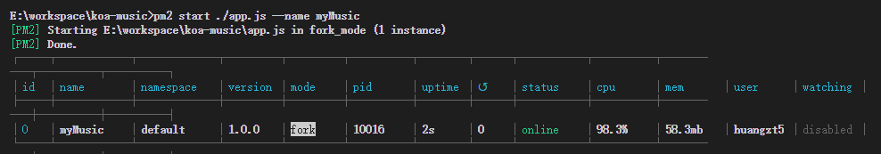
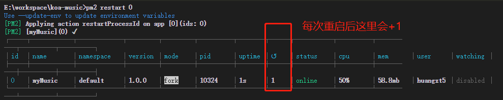
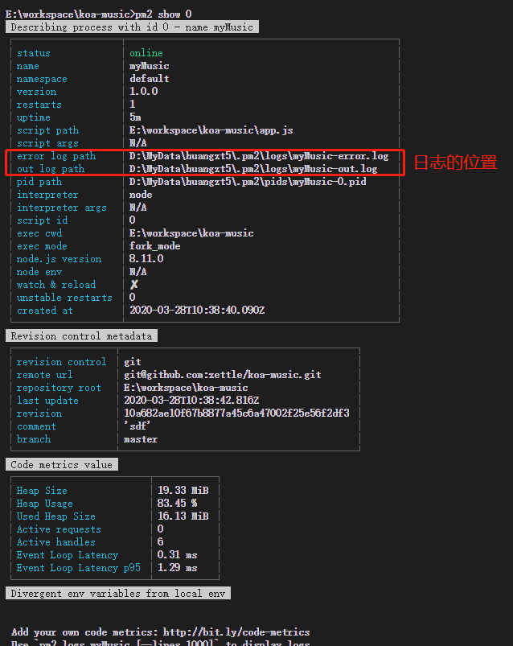
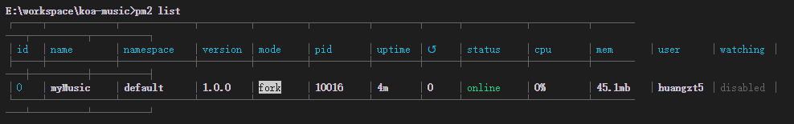
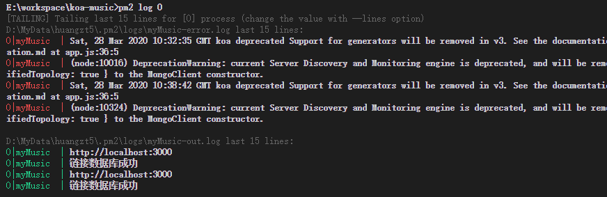
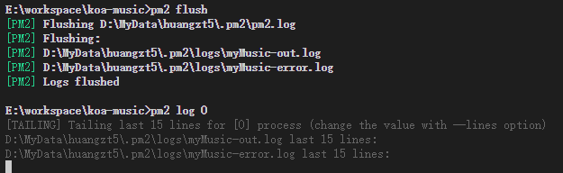
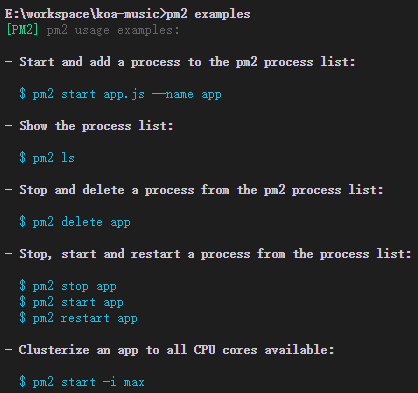

# 001-pm2的命令


## 1 启动
```shell
pm2 start [./app.js] --name [起的名字]
```
* `--name [projectname]`可以省略，省略的话就会以`[./app.js]`的文件名命令。我们很多项目都会用`app.js`作为入口，为了方便管理，给每个项目加上`--name`给其命好名。

比如启动
```shell
# 启动服务，起名叫myMusic
pm2 start ./app.js --name myMusic

# 启动服务，参数 `-i 3` 表示启动3个进程，用户访问的时候回随机一个
pm2 start ./app.js -i 3 --name myMusic
```




## 2 重启
```shell
# 重启
pm2 restart [all | name | id]

# 0秒重启，一般代码更新了执行这个reload就够了
pm2 reload [all | name | id]
```




## 3 停服务
```shell
pm2 stop [all | name | id]
```
* `pm2 stop all`: 表示停止所有程序

服务停了还会在list中显示，要通过`pm2 delete`删除


## 4 删服务
```shell
pm2 delete [all | name | id]
```


## 5 查看详细信息
```shell
pm2 show [name | id]
```



* `error log path`: 是错误日志的位置
* `out log path`: 是正常日志的位置

对于日志有专门的命令可以查看内容：`pm2 log`


## 6 查看启动的服务
```shell
pm2 list
```




## 7 查看日志 
```shell
# 查看历史日志
pm2 log [name | id]

# 查看实时日志
pm2 monit [name | id]
```



## 8 清除日志文件内容
```shell
pm2 flush
``` 



## 9 查看常用命令
```shell
pm2 examples
``` 
