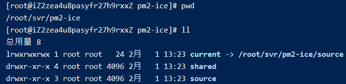
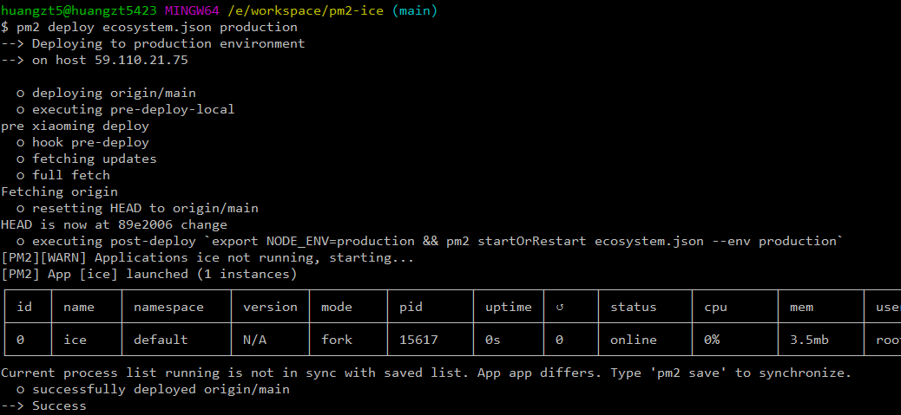

# 003-pm2一键发布项目

[pm2自动部署](https://www.jianshu.com/p/3946b009f190)


## 1 常规启动
1. 编写node项目，新建`server.js`文件
```js
const http = require('http');
// 这里要写为`0.0.0.0`不能写`127.0.0.1`否则不发访问
const hostname = '0.0.0.0';
const port = 7001;
const server = http.createServer((req, res) => {
    res.statusCode = 200;
    res.setHeader('Content-Type', 'text/plain');
    res.end('Hello World');
});
server.listen(port, hostname, () => {
    console.log(`server is running at http://${hostname}:${port}`)
});
```

2. 通过pm2启动项目
```shell
pm2 start ./app.js
```
访问`http://59.110.21.75:7001/`成功


## 2 pm2自动部署
1. 到github创建一个仓库`pm2-ice`，后面阿里云将从这个仓库clone代码

2. 在项目根目录编写ecosystem.json，内容如下: 
```json
{
    "apps": [{
        "name": "ice",
        "script": "server.js",
        "env": {
            "COMMON_VARIABLE": "true"
        },
        "env_production": {
            "NODE_ENV": "production"
        }
    }],
    "deploy": {
        "production": {
            "user": "root",
            "host": ["59.110.21.75"],
            "port": "22",
            "ref": "origin/main",
            "repo": "git@github.com:zettle/pm2-ice.git",
            "path": "/root/svr/pm2-ice",
            "ssh_options": "StrictHostKeyChecking=no",
            "pre-deploy-local": "echo 'pre xiaoming deploy'",
            "env": {
                "NODE_ENV": "production"
            }
        }
    }
}
```


2. 首次部署

把代码push代码到github上，并在win上启动`git bash`，执行部署命令
```shell
pm2 deploy ecosystem.json production setup
```

> window系统需要在`git bash`上，因为需要用到ssh服务

> 阿里云上需要安装git服务，因为会通过`git clone`拉取代码

这样阿里云就会通过git去指定仓库拉取代码进行首次部署

回到阿里云上可以看到项目结构已经创建好




3. 再次部署
在win本地执行部署命令
```shell
pm2 deploy ecosystem.json production
```



即部署完成


4. 每次修改完代码部署
每次改完代码，要push到远程仓库，然后执行`pm2 deploy ecosystem.json production`即可

> centos默认git版本是1.8.3.1，这个版本会造成执行完命令后，阿里云没有更新到最新代码的情况，[【解决方法: 升级git版本二】](https://blog.csdn.net/qq_28903377/article/details/86148687)

> 如果按照上面安装好git，但是执行`pm2 deploy`还是一直提示`bash: git: command not found`。可以执行下面命令创建软连接
```shell
# /usr/local/git/bin/ 为我们安装git的目录
# /usr/bin/ 为全局命令的目录
# 把我们的git命令创建一个软连接，存到 `/usr/bin` 目录里
ln -s /usr/local/git/bin/git /usr/bin/git
```