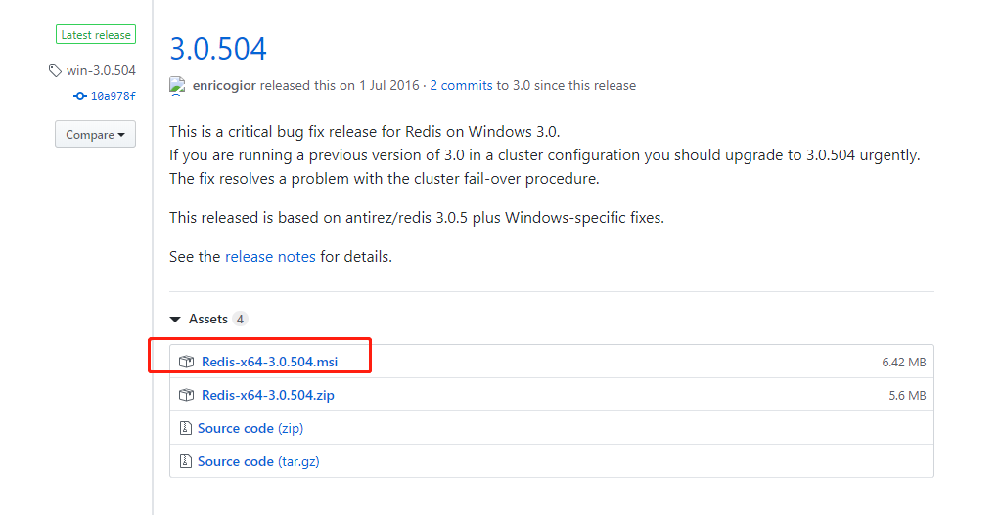
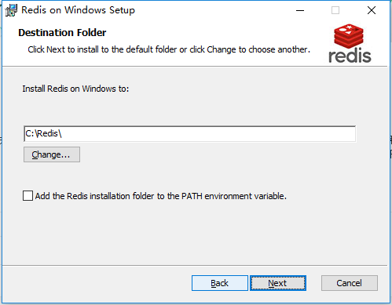
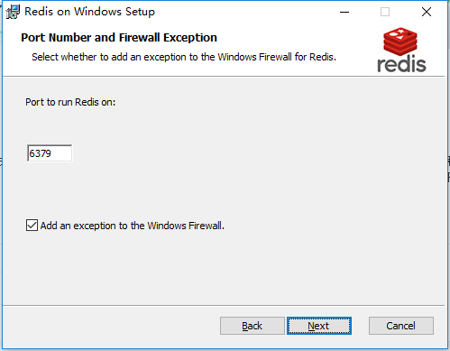
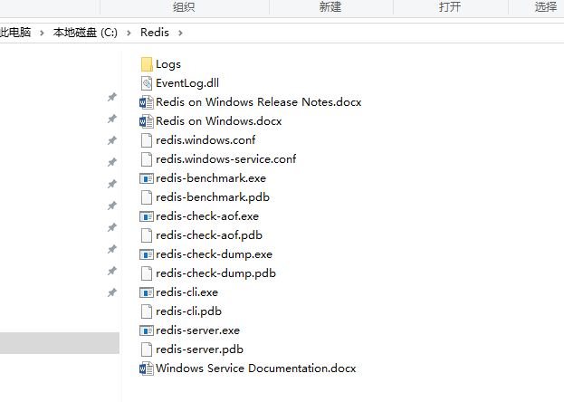
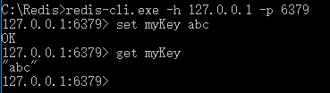

# 001-在window的安装

这里介绍的是window上redis的安装

1. 下载

从[github](https://github.com/microsoftarchive/redis/releases)下载对应的版本




2. 运行msi

待下载后运行msi，中途会让我们设置安装路径、端口、最大容量等数据。








3. 启动服务端

管理员运行cmd，进入安装好的路径里面`C:\Redis`。执行
```shell
redis-server.exe redis.windows.conf
```


4. 验证
另起一个cmd，执行
```shell
redis-cli.exe -h 127.0.0.1 -p 6379
```
启动客户端，执行
```shell
# 设置
set myKey abc

# 读取
get myKey
```
