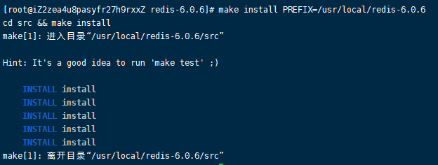
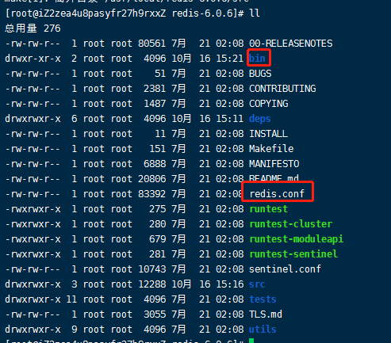
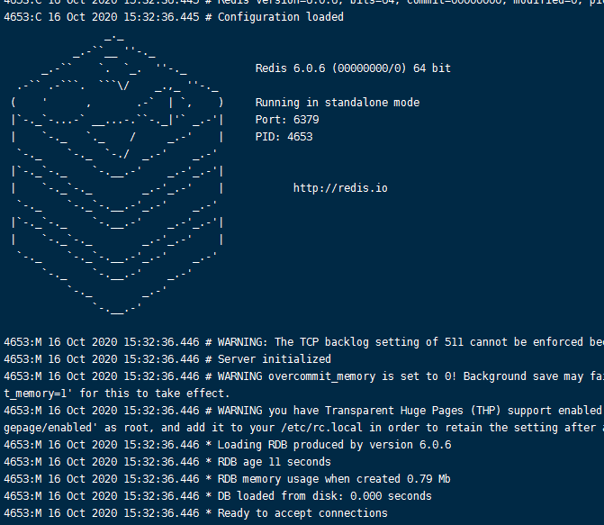
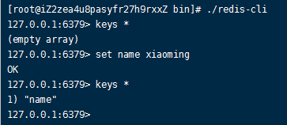

# 002-在Linux的安装


## 1 安装
1. 下载redis

从[官网](http://www.redis.cn/download.html)下载对应的版本，或者复制下载链接，到linux系统中执行下载并解压
```shell
# 进入自建的download目录
cd /root/download

# 下载redis
wget http://download.redis.io/releases/redis-6.0.6.tar.gz

# 解压
tar -zvxf redis-6.0.6.tar.gz
```


2. 复制到`/usr/local`目录里面

一般都会把应用存到local目录里面，将解压的复制到local目录里面
```shell
mv /root/download/redis-6.0.6 /usr/local/redis-6.0.6
```


3. 编译和安装

```shell
# 进入目录
cd /usr/local/redis-6.0.6/

# 编译
make

# 安装
make install PREFIX=/usr/local/redis-6.0.6
```
这里加了个 `PREFIX=/usr/local/redis-6.0.6`，作用是编译的时候用于指定程序存放的路径

比如我们现在就是指定了redis必须存放在`/usr/local/redis-6.0.6`目录。

假设不添加该关键字Linux会将可执行文件存放在`/usr/local/bin`目录，库文件会存放在`/usr/local/lib`目录。配置文件会存放在`/usr/local/etc`目录。其他的资源文件会存放在`usr/local/share`目录。

目录也方便后续的卸载，后续直接`rm -rf /usr/local/redis-6.0.6` 即可删除redis。

最终执行结果如下


再执行
```shell
ll
```
可以查看目录结构多了几个




4. 启动redis

在`/usr/local/redis-6.0.6/bin`里面启动redis-server
```shell
# 进入bin目录
cd ./bin

# 启动redis服务端，指定配置文件位置
./redis-server ../redis.conf
```
出现下面界面说明启动成功



上面的启动方式是前台方式启动，启动后，按`ctrl+c`或者回车键就会关闭redis服务。

如果想要后台服务方式启动，则只用下面命令
```shell
# 和上面命令的区别是这里最后加个 & 符号
./redis-server ../redis.conf &
```
后台服务方式启动的，按`ctrl+c`或者回车键后，redis服务依旧会继续运行


5. 访问redis
另起一个窗口连接服务器，然后进入redis的bin目录
```shell
# 进入bin目录
cd /usr/local/redis-6.0.6/bin/

# 启动redis客户端
./redis-cli

# 查看redis所有数据
keys *
```



## 2 查看redis进程
```shell
ps -ef |grep redis
```


## 3 停止redis
启动用的是redis-sever命令，停止用的是客户端的redis-cli
```shell
./redis-cli shutdown

# 再执行查看进程，已经查询不到了
ps -ef |grep redis
```