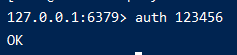

# 001-用docker安装redis

## 1、使用docker-compose创建

1. 编写docker-compose.yml
```yml
version: "3"
services:
  redis-test:
    image: "redis"
    restart: always
    container_name: "xiaoming_redis"
    ports:
      - 6379:6379
    volumes:
      - /root/svr/docker-redis/data:/data
    command: ["redis-server", "--requirepass", "123456"]
```
其中`123456`为密码

执行 `docker-compose up -d` 启动


2. 进入容器验证
```shell
docker exec -it xiaoming_redis redis-cli
```
进入了容器里面的redis客户端，由于在启动容器的时候设置了密码，所以需要验证下密码
```shell
auth 123456
```


接着就可以执行redis命令了
```shell
set name xiaoming
get name
```