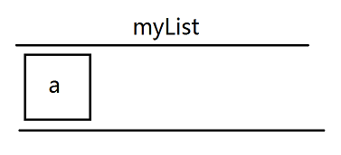
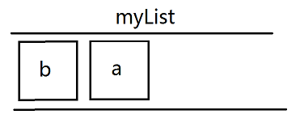
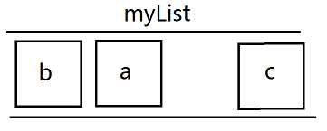

# 007-redis之list类型

list-列表操作

允许元素重复，可以添加一个元素到列表的头部（左边）或者尾部（右边）


## 1、存储
* 语法1: `lpush <key> <value>` 将元素加入列表左表
* 语法2: `rpush <key> <value>` 将元素加入列表右边
比如下面的场景:
```shell
lpush myList a
```


```shell
lpush myList b
```


```shell
rpush myList c
```


最终的队列为`b a c`

支持一次添加多个字符串
```shell
lpush myList a b c
```
比如上面，虽然是一句，但是添加也是一个字符串一个字符串添加的。先添加a，再添加b，最后添加c。所以在redis中顺序是`c b a`


## 2、获取
语法: `lrange <key> <start> <end>` 

获取key的内容，范围是start到end。下标0开始，`end=-1`的时候表示到结尾
```shell
lrange myList 0 -1
```


## 2、删除 
* 语法1: `lpop <key>` 删除列表最左边的元素，并将元素返回
* 语法2: `rpop <key>` 删除列表最右边的元素，并将元素返回
比如上面队列的`b a c`
```shell
lpop myList // 最左边的b被删除，并返回b
rpop myList // 最右边的c被删除，并返回c
```