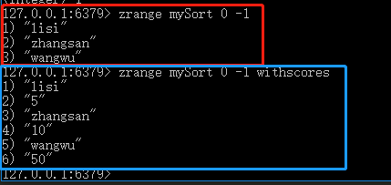

# 009-redis之sortedset类型
不允许重复，有序


## 1、存储
语法: `zadd <key> <score> <value>` 

添加key变量，权重是score，redis会根据score将数据升序排列
```shell
zadd mySort 10 zhangsan
zadd mySort 5 lisi
zadd mySort 50 wangwu
```


## 2、获取
语法: `zrange <key> <start> <end> [withscores]` 

加上参数withscores则会将权重分数一起打印出来
```shell
zrange mySort 0 -1
zrange mySort 0 -1 withscores
```



## 3、删除
语法: `zrem <key> <value>` 

把key中的value删除
```shell
zrem mySort lisi
```


