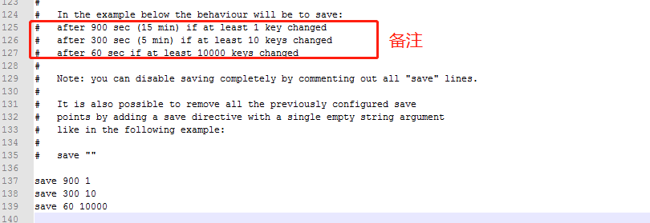

# 010-redis持久化
redis是一个内存数据库，当redis服务重启，数据就消失了。我们可以把redis内存中的数据持久化保存到硬盘中。


## 1、redis持久化机制
1. RDB: 默认方式，不需要进行配置，默认就是采用这种机制。redis每隔一段时间就检测所有key的变化，然后将数据持久化
2. AOF: 日志记录的方式，记录每一条命令的操作，每执行一条命令就保存数据一次，不太推荐，这种消耗内存


## 2、修改RDB配置
在`C:\Redis\redis.windows.conf`里面有配置
```
save 900 1
save 300 10
save 60 10000
```

```
# after 900 sec (15 min) if at least 1 key changed
15分钟后有1个key发生改变则会持久化

# after 300 sec (5 min) if at least 10 keys changed
5分钟后有10个key发生改变则会持久化

# after 60 sec if at least 10000 keys changed
1分钟后有10000个key发生改变则会持久化
```

如果修改配置，修改后不能用双击的方式运行redis服务端，需要在redis目录上打开cmd，执行exe并制定配置文件
```shell
redis-server.exe redis.windows.conf
```

## 3、开启AOF并配置

1. 开启，修改`redis.windows.conf`里面的配置，将`appendonly no`改为`appendonly yes`，这样redis就会开启AOF模式

2. 修改`redis.windows.conf`里面的配置，找到下面代码
```
# appendfsync always # always每一次操作都会持久化
appendfsync everysec # 每隔1s进行持久化
# appendfsync no     # 不持久化
```
选择其中的一种模式