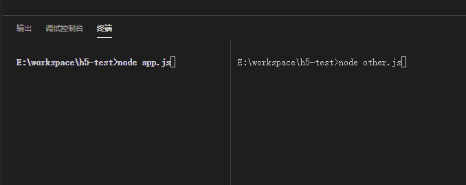

# 012-node操作redis消息发布

可以借助redis作为中介，实现2套程序之间的数据传输


模拟一台服务器，用作监听
```js
// other.js 的代码
const redis = require('redis');
const client = redis.createClient(6379, 'localhost');

client.subscribe('testPublich'); // 订阅`testPublich`事件，一旦有人发送这样一条的事件，就会触发下面的message监听
client.on('message', function (channel, msg) {
    console.log('获取消息频道', channel);
    console.log('获取消息内容', msg, typeof msg);
});
```

模拟另外一台服务器，用作发送消息
```js
// app.js 的代码
const redis = require('redis');
const client = redis.createClient(6379, 'localhost');

// 会发送到redis，然后redis会广播到各个连接端
// 第2个参数只能传递字符串，如果是数字/布尔型会转为字符串
client.publish('testPublich', '我是小明');
```

先启动other.js的服务器`node other.js`

再启动app.js的服务器`node app.js`




