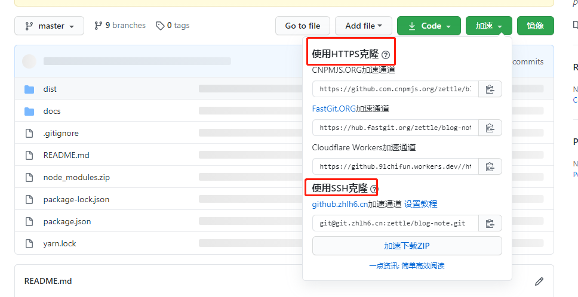
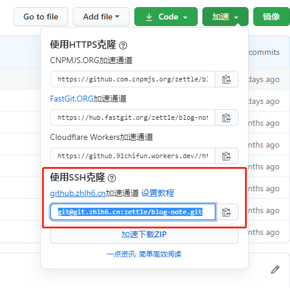

# 001-github加速

由于github是国外的，所以clone的时候时常太慢导致clone失败，所以需要用过国内的加速


## 1 安装
安装[Github 加速器](https://chrome.zzzmh.cn/info?token=mfnkflidjnladnkldfonnaicljppahpg)这个chrome扩展插件


## 2 在github仓库就可以看到多出来的，选择其中一个通道既可


> 需要注意的是上面列表中，有的是https，有的是ssh通道
> 如果选择的是https就没什么好说的，每次push都是输入账号密码
> 如果是想要选择ssh加速的通道，则需要按照配置下

## 3 配置ssh并且是加速通道
[资料](https://github.com/fhefh2015/Fast-GitHub)

配置步骤:

1. 启动`git bash`

2. 进入ssh文件夹
```shell
cd ~/.ssh
```

3. 新建config文件，**注意没有后缀。**内容如下:
```config
Host git.zhlh6.cn
    HostName git.zhlh6.cn
    User zettle
    IdentityFile ~/.ssh/id_rsa
```

4. 执行下面命令
```shell
ssh -T git@git.zhlh6.cn
```
看到下面提示则代表配置成功
```
You've successfully authenticated, but GitHub does not provide shell access
```

5. 这样就clone的时候就可以用`github.zhlh6.cn`的链接了，即是ssh通道又是加速的



