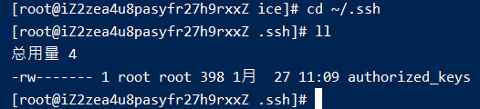

# 002-生成ssh密钥

1. 查看下自己有没有生成过ssh密钥
```shell
cd ~/.ssh
ll
```
如果该目录下没有`id_dsa`和`id_dsa.pub`这2个文件说明没有生成过



2. 生成ssh密钥
执行
```shell
ssh-keygen -o
```
执行后，会出现下面输入选择项
```
Enter file in which to save the key (/home/xiaoming/.ssh/id_rsa):
Created directory '/home/xiaoming/.ssh'.
Enter passphrase (empty for no passphrase):
Enter same passphrase again:
```
上面几个输入选择项的意思分别是:
* 确认密钥的存储位置，如果不想修改默认路径，就直接回车
* 输入密钥口令，如果不需要就直接回车


2. 查看公钥
执行完上面的操作后，会在指定目录上生成`id_dsa`和`id_dsa.pub`这2个文件，其中`id_dsa.pub`就是我们经常用到的，把里面内容复制到git或者服务器上即可ssh登录
```shell
cat id_dsa.pub
```