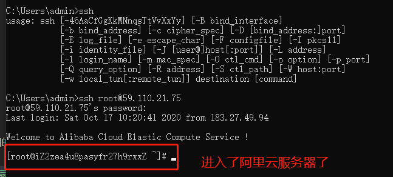
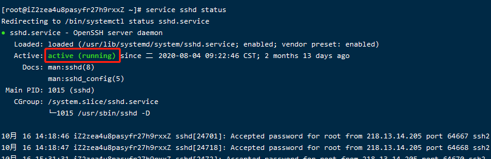
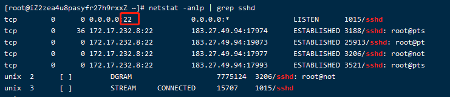
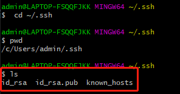
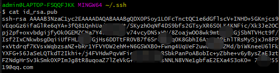
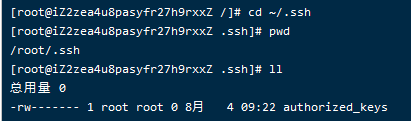

# 001-免密登录服务器

比如我们阿里云服务器IP是: `59.110.21.75`，账号是root

## 1、密码方式登录
在win上启动`git bash`。执行下面命令
```shell
ssh root@59.110.21.75
```
然后输入密码，即可登录阿里云服务器



如何不是默认22端口，则加上端口号`ssh -p 端口号 账号@IP地址`


## 2、使用ssh免密码登录

1. 登录阿里云查看ssh状态
执行命令
```shell
# 该命令是centos的，其他系统的自行百度
service sshd status
```
看到下面内容说明阿里云的ssh是运行的。



查看阿里云服务器ssh服务的端口，执行
```shell
netstat -anlp | grep sshd
```
得到下面的截图，说明现在监听的是22端口


> 如果想要修改默认端口，则执行命令`vim /etc/ssh/sshd_config`
看到下面内容，把port端口修改下
```shell
# The strategy used for options in the default sshd_config shipped with
# OpenSSH is to specify options with their default value where
# possible, but leave them commented.  Uncommented options override the
# default value.

# If you want to change the port on a SELinux system, you have to tell
# SELinux about this change.
# 下面的代码提示，如果改了端口，要执行下面的命令
# 比如改为端口10022，那么改后需要执行`semanage port -a -t ssh_port_t -p tcp 10022`
# 然后再重启下`service sshd restart`
# semanage port -a -t ssh_port_t -p tcp #PORTNUMBER
#
#Port 22
#AddressFamily any
#ListenAddress 0.0.0.0
#ListenAddress ::
```


> 更多配置信息可以查看[2-sshd_config文件的解读](./2-sshd_config文件的解读.md)

> 注意配置文件是sshd_config而不是ssh_config，2者都在同级目录下面


2. 在本地电脑生成ssh公私钥
如果是以前已经生成过想要查看则可以执行`cd ~/.ssh`就可以进入ssh配置目录



因为以前我们生成过就不生成了，可以看到上面的目录结构

查看公钥的内容，复制出来




3. 在阿里云服务器也进入ssh目录
```shell
cd ~/.ssh
```
看到下面的目录



如果linux没有上面目录，则可以执行`mkdir -p ~/.ssh`创建文件夹

编辑authorized_keys文件`vim authorized_keys`

把本地电脑的`id_rsa.pub`复制到阿里云服务器的`authorized_keys`里面保存


### 2.4 免密登录服务器
回到本地电脑，执行下面密码
```shell
ssh root@59.110.21.75
```
不再需要密码了

有时候记住IP地址不方便，我们可以写个配置文件。

在本地电脑的ssh目录下，新建config文件（注意文件名就叫config，没有后缀名的）
```ssh
cd ~/.ssh
vim config
```

config的内容如下
```conf
Host aliyun     # 自己起的别名，方便自己记住   
    Port 22     # 阿里云服务器ssh的端口号
    HostName 59.110.21.75  # 阿里云服务器IP地址
    User root   # 要登录的账号
    IdentityFile ~/.ssh/id_rsa # 我们本地电脑的私钥位置，注意这里是私钥
```
> 注意上面的注释部分不要写入代码里面 
