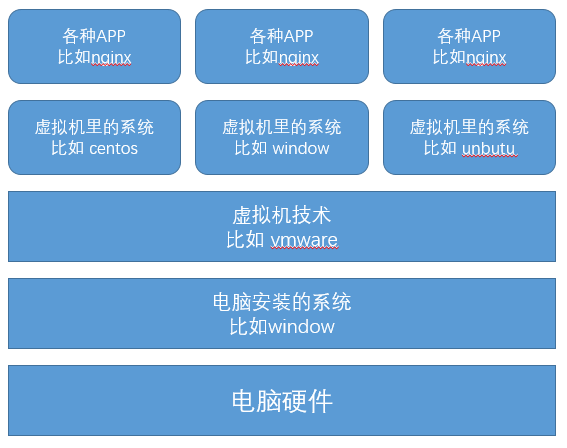
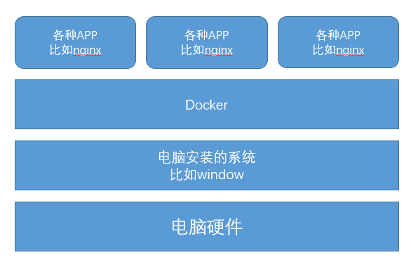

# 001-docker介绍

docker是一个轻量级的容器，开发可以打包项目应用、依赖到该容器中，然后发布到任何Linux机器上。

## 1、docker三要素
* 镜像: Image，用来组合创建容器
* 容器: Container，由不同的镜像组合而成，可以启动停止删除，容器相互之间独立
* 仓库: 存放镜像的地方，可以理解为就是[官网](https://registry.hub.docker.com/)

## 2、docker和虚拟机有什么区别
* 生活中最常用的虚拟机就是平时我们在window上，安装个vmware，然后再安装个Centos系统，一整套下来，就得几十G的大小。而docker容器很小启动很快

* 底层不一样，虚拟机实现原理如下图所示

而docker运行原理如下

