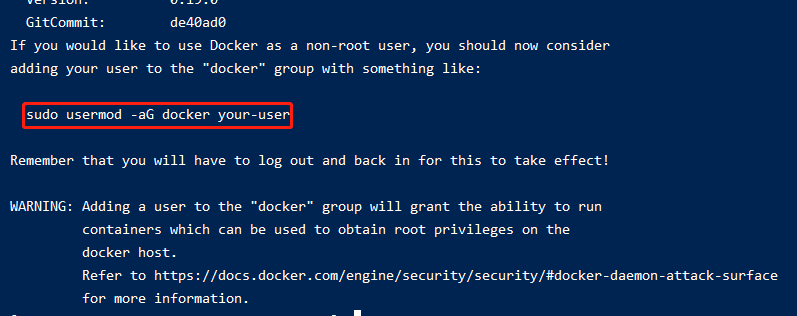
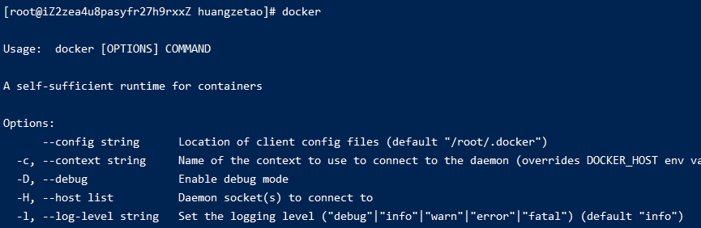
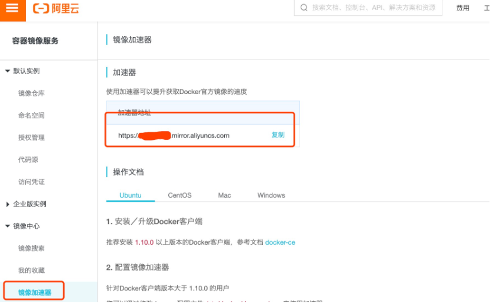
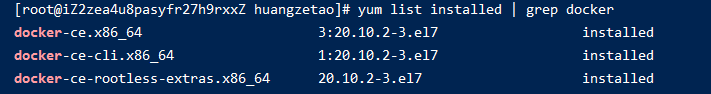

# 002-docker在Linux的安装和卸载


## 1、安装docker
参考资料: [Linux安装docker](https://www.runoob.com/docker/centos-docker-install.html)

1. 执行 
```shell
curl -fsSL https://get.docker.com | bash -s docker --mirror Aliyun
```
执行完后看到下面结果，表示安装完成了



看上面提示中有一句话`sudo usermod -aG docker your-user`，提示我们可以执行这条命令给予权限

docker安装后，默认情况下只允许root用户来执行，比如执行:`sudo usermod -aG docker apps`

执行上面是为了给用户apps这个用户加到docker组里面，这样apps这个用户就有了执行docker的权限了

2. 验证
```shell
docker
```
看到下面结果说明docker已经安装好了




## 2、镜像加速
由于国内墙的问题，需要配置下阿里云的加速器，这样就直接从阿里云下载

1. 通过[阿里云镜像获取地址](https://cr.console.aliyun.com/cn-hangzhou/instances/mirrors)获取到地址



2. 在服务器上执行
```shell
mkdir -p /etc/docker

vim /etc/docker/daemon.json
```

3. 编辑`daemon.json`的内容，如下
```
{
  "registry-mirrors": ["https://6z3gokzw.mirror.aliyuncs.com"] // 具体值从阿里云管理平台获取
}
```

4. 重新加载配置并重启
```shell
systemctl daemon-reload

systemctl restart docker
```


## 3、卸载docker

[参考资料](https://blog.csdn.net/qq_36421955/article/details/87802942)

1. 执行`yum list installed | grep docker`，查看yum安装过哪些，得到下面的结果



2. 把上面列表的都删除即可，执行
```shell
yum -y remove docker-ce-cli.x86_64

yum -y remove docker-ce.x86_64
```

3. 执行`rm -rf /var/lib/docker`

4. 执行`docker`检查，已经报没有该命令了
