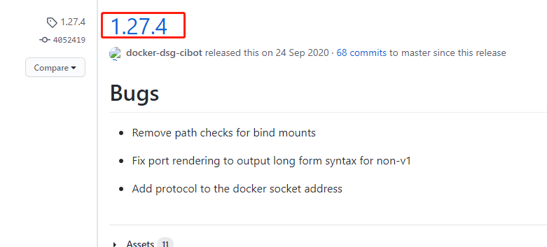

# 003-docker在Linux安装compose

## 安装docker-compose

1. 查看稳定版本
到[官网](https://github.com/docker/compose/releases)查看下现有的版本。我们以`1.27.4`为例子



2. 执行命令

国外的镜像: 
```shell
sudo curl -L "https://github.com/docker/compose/releases/download/1.27.4/docker-compose-$(uname -s)-$(uname -m)" -o /usr/local/bin/docker-compose
```
上面命令的意思是: 把指定的链接下载然后用存到指定的管道中，
* `uname -s`和`uname -m`是Linux上的命令，查看当前是什么系统以及版本号
* `/usr/local/bin/`是Linux上存全局命令的地方，这样子就在任何文件夹中都可以执行docker了

国内的镜像:
```shell
sudo curl -L "https://get.daocloud.io/docker/compose/releases/download/1.27.4/docker-compose-$(uname -s)-$(uname -m)" -o /usr/local/bin/docker-compose
```

3. 执行命令` docker-compose`有看到内容就是安装完成

