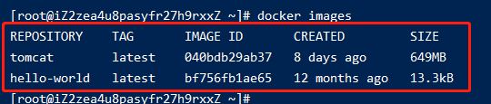
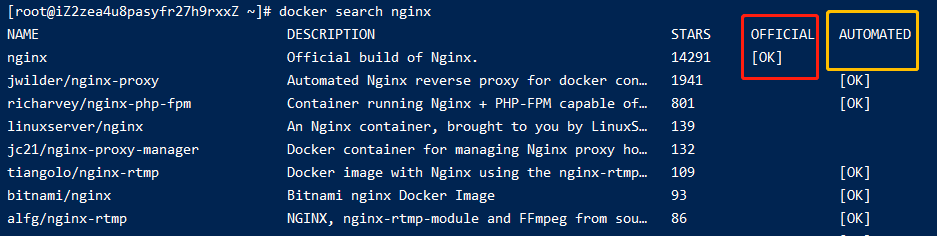
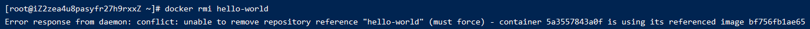
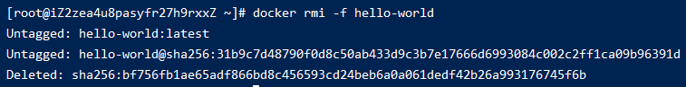

# 005-docker镜像命令

## 1、列出本地所有镜像
`docker images [可选参数]` 会列出本地已经存在的所有镜像

### 1.1 可选参数
|     参数    | 说明  |
|  --------  | ----  |
| -a         | 显示所有镜像，包括中间层 |
| -q         | 只显示镜像ID |
| -qa        | 是`-a`和`-q`的组合 |
| --digests  | 显示摘要信息 |
| --no-trunc | 显示完整信息 |

## 2、搜索镜像
`docker search [名字] [可选参数]`: 从[docker仓库](https://registry.hub.docker.com/)搜索某个镜像

其中
* `OFFICIAL`: 意为官方镜像
* `AUTOMATED`: 意为自动构建类型的镜像

### 2.1 可选参数
|     参数      | 说明  |
| ------------ | ----  |
| --no-trunc   | 显示完整信息 |
| --filter或-f | 基于给定条件过滤输出 |
| -s           | **弃用**，推荐用`--filter` |
| --automated  | **弃用**，推荐用`--filter` |

* `docker search nginx --filter stars=100`: 搜索出点赞数大于等于100的nginx镜像
* `docker search nginx --filter is-automated=true`: 搜索出属于自动构建的nginx镜像
* `docker search --filter is-official=true --filter stars=100 nginx`: 搜搜出官方并且点赞数大于100的nginx镜像

## 3、下载镜像
`docker pull [名字][:版本号]`

## 4、删除镜像
`docker rmi [名字][:版本号]`

在删除的时候，如果镜像以前有运行过，即产生过容器。那么docker会要求我们先删除以前的运行过的容器

一种就是我们执行删除容器的命令先删除容器，再来删除镜像。

另外一种就是执行`docker rmi -f`强制删除，这条命名会先去删除容器再上传镜像

