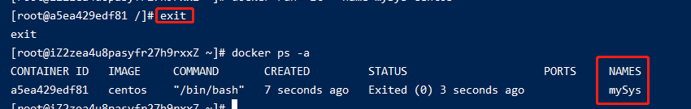
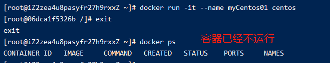
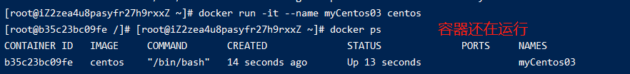
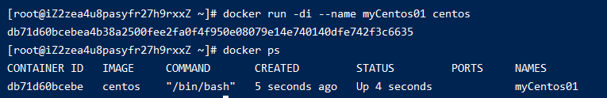
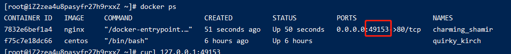
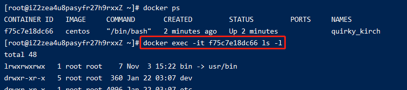
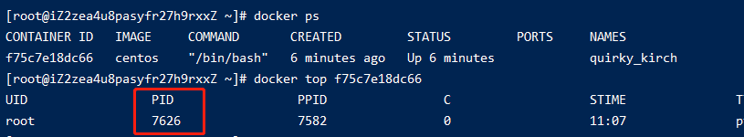

# 006-docker容器命令

## 1、创建启动容器
`docker run [配置] image [命令] [参数]`

## 1.1 交互式启动
`docker run -it --name 别名 镜像ID`: 运行镜像，并为其起个别名，并且交互模式运行，以及分配一个伪终端

这种启动会进入镜像里面，常用于比如centos镜像等系统镜像

比如执行`docker run -it --name mySys centos`后

从截图可以看出已经是进入了centos系统里面了，退出的话敲`exit`

而`--name`的作用是起别名，会作为容器的name属性，如下图

##### 进入容器后的退出
退出有2种方式: `exit` 和 `ctrl+P+Q`。前者是退出并容器停止，后者是退出容器继续运行

* exit的退出

* `ctrl+P+Q`

## 1.2 守护进程的方式启动
`docker run -di --name 别名 镜像ID`: 用守护进程的方式启动，和`-it`的区别是不会进入容器里面

## 1.3 端口映射
`-p` 或 `-P`: 前者固定宿主机端口，格式`宿主机端口:容器端口`。后者宿主机随机端口

* `docker run -it -p 8888:80 nginx`: 宿主机的8888端口映射到容器里面，这个时候访问`http://aaa.com:8888`就可以访问到
* `docker run -it -P nginx`: 宿主机的随机端口映射到容器里面，如果想要看这个随机端口是多少，可以执行`docker ps`命令

## 2、列出容器
`docker ps [参数]`

### 2.1 可选参数
|     参数      | 说明  |
| ------------ | ----  |
| -n 数字   | 列出最近的几个容器 |
| -a       | 列出所有容器，包括已经停止的 |
| -f status=exited  | 查看已经停止的 |

### 2.2 列出最近的几个容器
` docker ps -n 2`: 列出最近启动的2个容器

### 2.3 查看已经停止的
`docker ps -f status=exited`

## 3、退出容器
退出有2种方式: `exit` 和 `ctrl+P+Q`。前者是退出并容器停止，后者是退出容器继续运行

* exit的退出

* `ctrl+P+Q`

## 4、进入容器
`docker attach [容器id或容器名]`: 进入正在运行的容器内部，这种一般进入centos等镜像

`docker exec -it [容器id或容器名] [命令]`: 进入容器执行命令，然后退出容器回到宿主机。这种一般用于`redis/nginx`等镜像

## 5、启动容器
`docker start [容器id或容器名]`: 将已停止的容器启动

## 6、重启容器
`docker start [容器id或容器名]`: 将正在运行的容器重启

## 7、停止容器
`docker stop [容器id或容器名]`: 将正在运行的容器停止掉

`docker kill [容器id或容器名]`: 将正在运行的容器停止掉，不推荐

## 8、删除容器
`docker rm [容器id或容器名]`: 将已停止的容器删除，

### 8.1 强制删除
如果是正在运行的，需要强制删除`docker rm -f`

### 8.2 删除多个
`docker rm [容器id或容器名] [容器id或容器名]`: 多个容器之间用空格隔开

### 8.3 删除所有容器
`docker rm $(docker ps -qa)`: 删除所有容器

## 9、查看容器日志
`docker logs [容器id或容器名]`

## 10、查看容器的进程
`docker top [容器id或容器名]`: 查看正在运行的容器的进程

## 11、复制
* `docker cp [宿主机要拷贝的文件] [容器id或容器名]:[容器目录]`: 宿主机copy到docker容器里面
* `docker cp [容器id或容器名]:[容器目录] [宿主机要存的位置]`: docker容器copy到宿主机

简单的做，源文件在前，目标位置在后

