# 007-docker发布镜像

定制自己的镜像: `docker commit -a="[作者]" -m "[备注]" [镜像id或名称] [起的镜像名字]`


## 1、如何定制自己的nginx

1. 启动nginx镜像
首先启动nginx镜像: `docker run -di -p 8080:80 --name myNg nginx`

用进程式的方式启动，宿主机的8080端口映射到nginx镜像

通过`docker ps`可以查看镜像情况

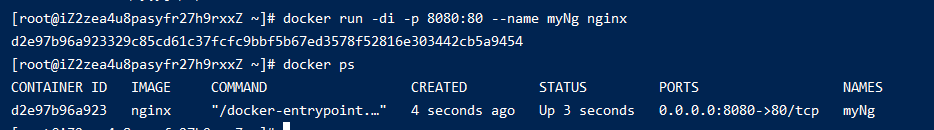


2. 通过 `http://59.110.21.75:8080/` 访问如下

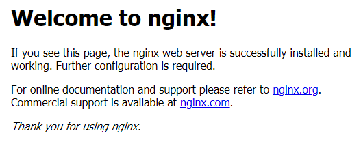

3. 进入该镜像，修改页面内容
```shell
# 进入镜像
docker exec -it d2e97b96a923 /bin/bash
```
因为镜像里面没有vim等工具，所以把页面index.html复制到宿主机上，修改完再复制进镜像
```shell
# 复制index.html到宿主机
docker cp d2e97b96a923:/usr/share/nginx/html/index.html /root/download/

# 修改html并保存
vim index.html

# 把修改后的index.html复制到镜像
docker cp  /root/download/index.html a5e176992b40:/usr/share/nginx/html/index.html
```

4. 在访问`http://59.110.21.75:8080/`，结果如下:

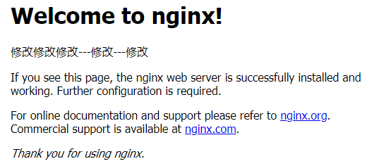


5. 修改我们的镜像修改好了，准备做成自己的镜像
```shell
docker commit -a="xiaoming" -m "my nginx image" a5e176992b40 zett/nginx
```
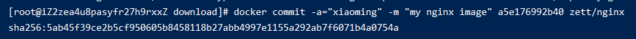

执行`docker ps`

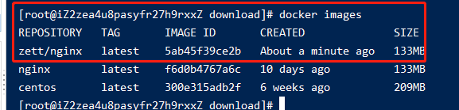

6. 再启动刚才制作好的镜像

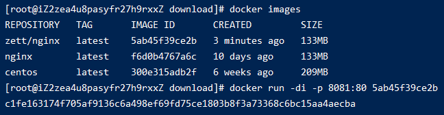


7. 访问 `http://59.110.21.75:8081/` 即可看到我们自己做的nginx


## 2、推送到docker仓库
先到[docker仓库](https://registry.hub.docker.com/)注册个账号

执行`docker login`，输入账号密码在Linux上登录下

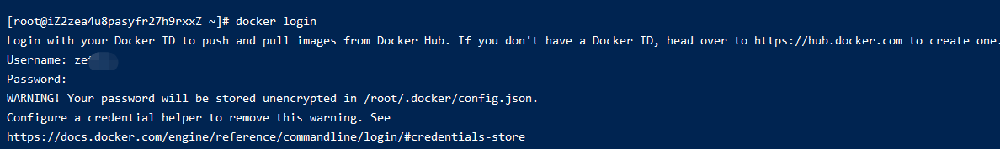

执行`docker push [镜像名称]:[版本号]`推送上远程仓库
```shell
docker push zett/nginx
```

> 注意: 在dockerHub上我的账号名是zettle，而这里的镜像前缀是zett。直接push的时候会提示`denied: requested access to the resource is denied
`，如下:

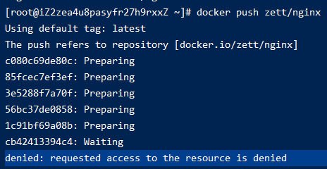

这种时候，要先执行下`docker tag [本地镜像名称] [将要存的真正dockerHub的镜像名]`

```shell
# zett/nginx 是本地的镜像名称
# zettle/nginx 是因为我的账号名叫zettle
docker tag zett/nginx zettle/nginx
```
`docker tag`会在本地再复制出一个镜像

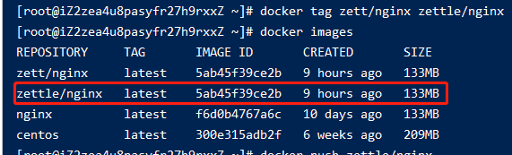


然后再执行`docker push zettle/nginx`即可

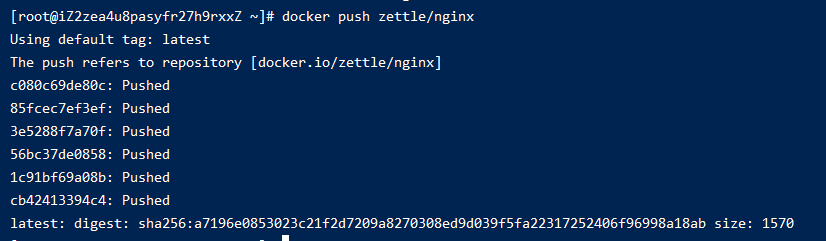


## 3、从远程pull我们自定义的镜像
先把本地的镜像删除掉

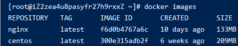

执行`docker pull zettle/nginx`

现在就和平常一样启动就可以


## 2、推送到阿里云仓库
上面推动到的是[docker的官方仓库](https://registry.hub.docker.com/)由于是国外的，push和pull的速度都很慢。

想要快的话，就用[阿里云的镜像](https://cr.console.aliyun.com)

镜像的账号密码就是登录阿里云的账号密码


### 2.2 创建一个属于自己的命名空间
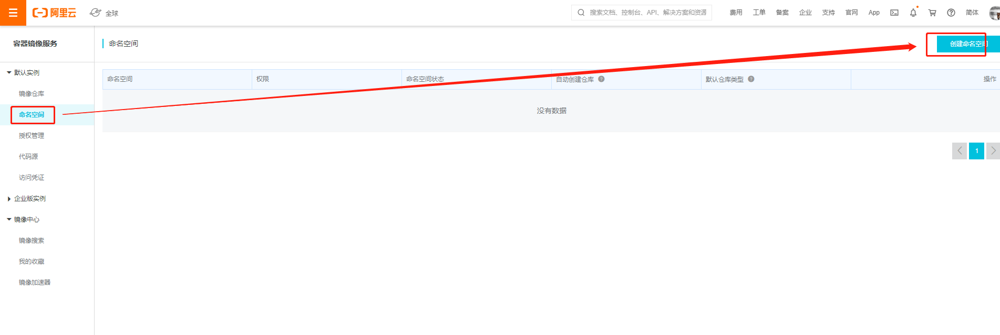


### 2.3 创建一个属于自己的仓库
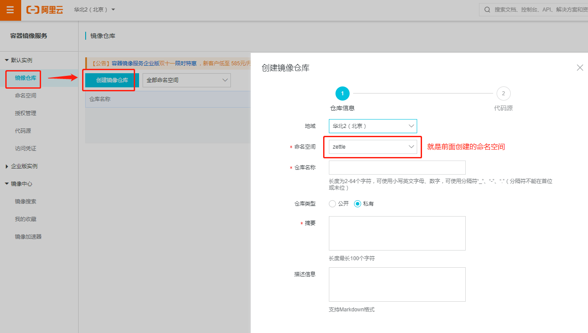

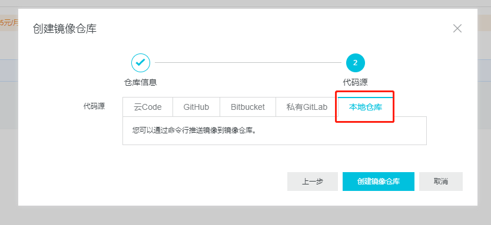

创建好后如下图

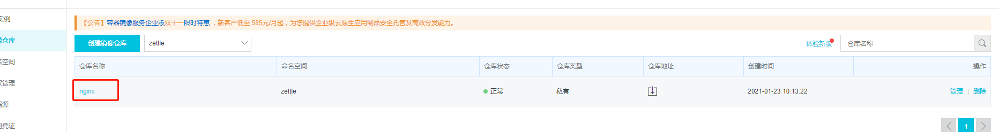

点击进入可以看到怎么发布的详细步骤

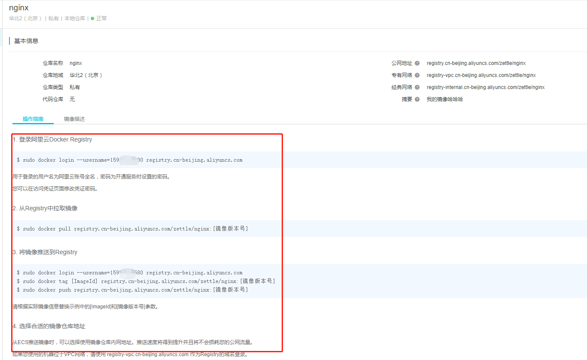

首先登录
```shell
# 登录 159XXXXXXX 
docker login --username=159XXXXXXX registry.cn-beijing.aliyuncs.com
```

然后打tag
```shell
# 5ab45f39ce2b为本地镜像的id
# 为其打个tag命名为registry.cn-beijing.aliyuncs.com/zettle/nginx
# 1.0.0 为版本号
docker tag 5ab45f39ce2b registry.cn-beijing.aliyuncs.com/zettle/nginx:1.0.0
```

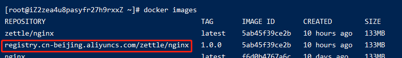

最后push
```shell
docker push registry.cn-beijing.aliyuncs.com/zettle/nginx:1.0.0
```
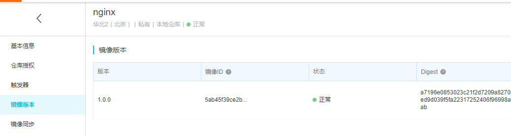

当想要pull的时候，执行下面
```shell
docker pull registry.cn-beijing.aliyuncs.com/zettle/nginx:1.0.0
```

