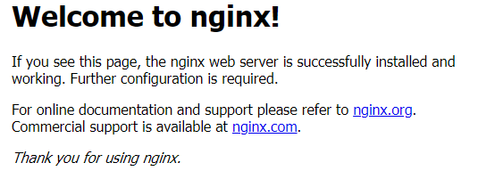
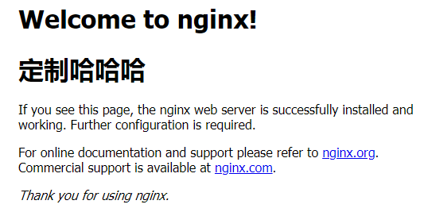
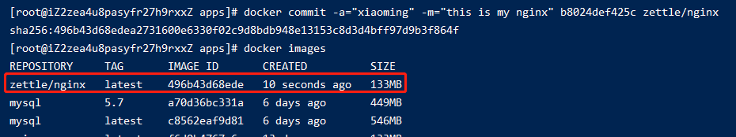
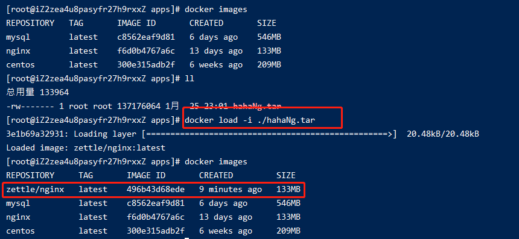

# 009-docker的迁移和备份

我们自定义镜像后，commit提交成本地镜像后，往往会push到远程仓库。但实际上，由于公司项目私密性，并不会push到远程仓库。

这个时候就需要通过docker镜像备份和迁移


## 1、备份和还原的语法
备份语法: `docker save -o [起的镜像名称] [本地镜像名称]:[tag版本]`

> 注意这里一定要写镜像名称，不要镜像id
> 备份到当前目录，备份后生成一个tar文件

恢复语法: `docker load -i [tar文件名称]`


## 2、例子
用nginx，我们自己改点index.html的内容，形成自己的nginx镜像

1. 启动nginx镜像，映射到宿主机的7002端口
```shell
docker run -di -p 7002:80 nginx
```

2. 访问`http://59.110.21.75:7002`



3. 进入正在运行的nginx镜像，修改index.html。因为镜像里面没有vim等工具，我们把index.html复制到宿主机，修改完后再复制进镜像
```shell
# 复制到宿主机 b8024def425c为容器id
docker cp b8024def425c:/usr/share/nginx/html/index.html /apps/myNg/index.html

vim /apps/myNg/index.html

# 复制会nginx容器里面
docker cp /apps/myNg/index.html b8024def425c:/usr/share/nginx/html/index.html
```

4. 再访问`http://59.110.21.75:7002`



5. 生成本地镜像
```shell
# -a:作者  -m:备注  b8024def425c:容器id
docker commit -a="xiaoming" -m="this is my nginx" b8024def425c zettle/nginx
```


6. 如果是可以推动远程仓库，那么到这里就是push到远程仓库了。不过这里公司因为私密性不准推动远程仓库。

我们把生成好的镜像备份成tar压缩包
```shell
# 注意.tar要写上去
docker save -o hahaNg.tar zettle/nginx:latest
```
这个命令会在当前目录上生成`hahaNg.tar`文件

7. 把`hahaNg.tar`文件发给其他同事，其他同事把该tar上传到服务器上，然后执行
```shell
docker load -i ./hahaNg.tar 
```

