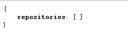
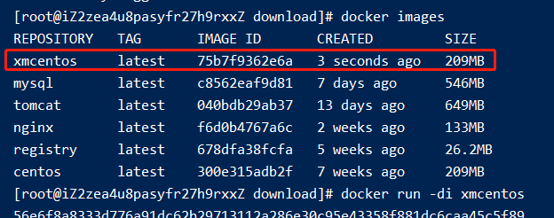
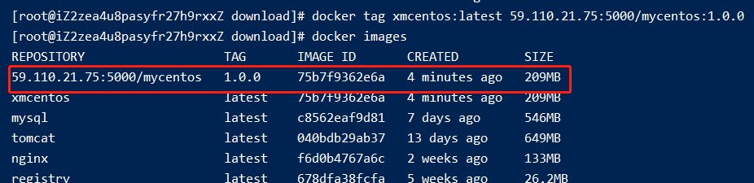
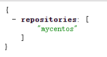
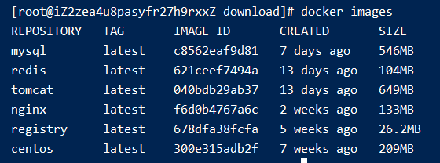
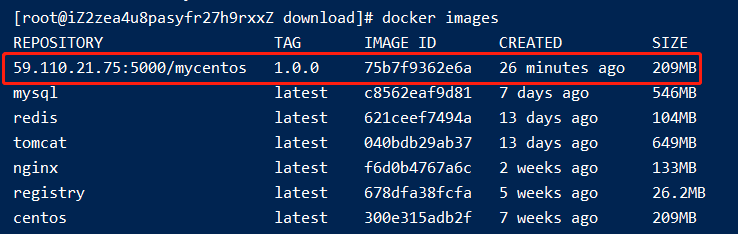

# 010-docker私服搭建

1. 拉取私服镜像: `docker pull registry`
2. 运行镜像: `docker run -di --name myPriDocReg -p 5000:5000 registry`
3. 访问 `http://59.110.21.75:5000/v2/_catalog` 得到下面结果说明搭建成功。

现在仓库里什么都没有所以为空的



4. 修改`daemon.json`，让docker信任私有仓库地址
```shell
vim /etc/docker/daemon.json
```
新增内容如下:
```json
{
    "insecure-registries": ["59.110.21.75:5000"]
}
```

5. 重启
```shell
systemctl restart docker
```


6. 打tag
格式: `docker tag [要打tag的镜像名]:[版本号] [私服IP端口]/[要起的名字]:[版本号]`

选择一个自己的镜像



执行`docker tag xmcentos:latest 59.110.21.75:5000/mycentos:1.0.0`打tag




7. push到私服
格式: `docker push [docker images查出的名字]:[版本号]`

执行`docker push 59.110.21.75:5000/mycentos:1.0.0`

8. 在访问 `http://59.110.21.75:5000/v2/_catalog` 可以看到数据了



9. 恢复到干净的镜像状态



10. 从私服拉取镜像: `docker pull 59.110.21.75:5000/mycentos:1.0.0`



