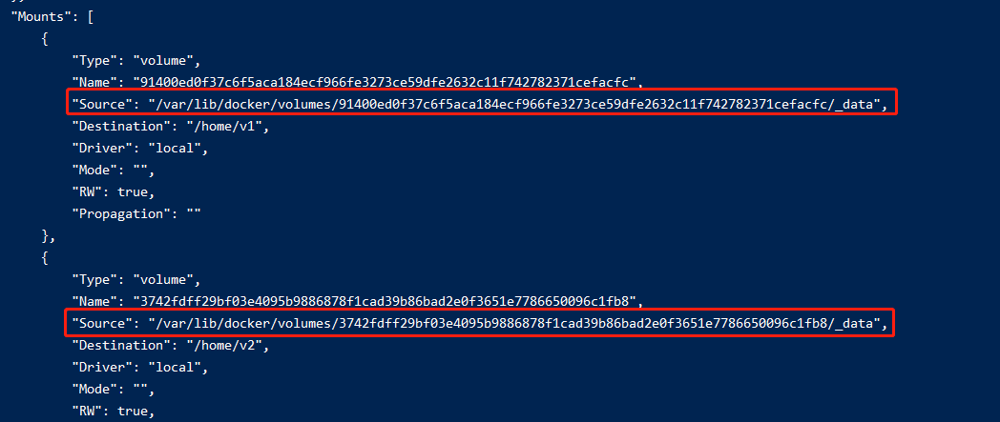

# 103-dockerFile的volume

dockerFile里面自带了VOLUME指令，可以指定镜像中的数据卷。

在前面的docker中也有对应的参数`-v`，但是`-v`可以支持我们自定义宿主机到镜像路径的映射

而dockerFile的VOLUME不行，只能定义镜像里面的路径，然后docker会自动在宿主机创建一个随机的路径作为数据卷


## 1、例子

1. 编写dockerFile
```docker
FROM centos
VOLUME [ "/home/v1", "/home/v2" ]
CMD /bin/bash
```
上面定义了centos镜像，镜像中的 `/home/v1` 和 `/home/v2` 与宿主机数据共享

2. 构建成镜像
```shell
docker build -f ./dockerFile -t xhcentos .
```

3. 查看构建的镜像并启动
```shell
docker images
docker run -it xhcentos
```

4. 通过`docker inspect`查看容器的详细信息
```shell
# 47a700511b8b: 容器id
docker inspect 47a700511b8b
```
在详细信息里面有个`Mounts`字段，里面就记录了容器的各个数据卷，通过`source`字段就可以知道宿主机的位置了


5. 修改共享数据卷
```shell
cd /var/lib/docker/volumes/91400ed0f37c6f5aca184ecf966fe3273ce59dfe2632c11f742782371cefacfc/_data

vim haha.txt
```
再进入容器，就可以看到共享数据卷的同步过来了
```shell
docker attach 47a700511b8b

cd /home/v1
```
