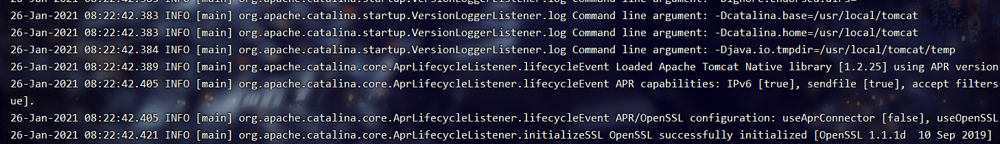
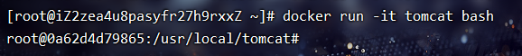
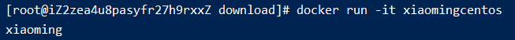
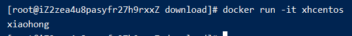

# 104-dockerFile的CMD

##  1、CMD的语法
* `CMD ["executable","param1","param2"] (exec form, this is the preferred form)`: 运行一个可执行的文件并提供参数。
* `CMD ["param1","param2"]`: 为ENTRYPOINT指定参数
* `CMD command param1 param2 (shell form)`: 执行某条shell命令，是以`/bin/sh -c`的方法执行的命令


##  2、ENTRYPOINT的语法
* `ENTRYPOINT ["executable","param1","param2"](exec格式推荐)`: 
* `ENTRYPOINT command param1 param2`: 

## 2、CMD和ENTRYPOINT的区别
相同点: CMD和ENTRYPOINT都是容器启动的时候，执行的命令；都支持exec和shell方式；

一般用法: 单独一个CMD或者先ENTRYPOINT后CMD结合使用

假如有多个CMD，启动的时候带参数，会覆盖前面的CMD命令，最后一个命令生效。所以我们平时用CMD的时候，有一种情况的就是单独用一个CMD命令即可，启动命令不带参数


**比如tomcat**

[tomcat](https://github.com/docker-library/tomcat/blob/2c472565d72a03201789ddd3fb4bec3316a609e9/10.0/jdk15/openjdk-oraclelinux7/Dockerfile)在最后就是`CMD ["catalina.sh", "run"]`就是CMD的一种用法

我们在启动的时候执行`docker run -it tomcat`会自动启动tomcat就是因为这句CMD




假如我们启动命令这么写 `docker run -it tomcat /bin/bash`那么就会用`bash`替代CMD命令，因为CMD是只执行最后一个的。就会发现tomcat不会自动启动了




**多个CMD的例子**

有下面的dockerFile文件，
```docker
FROM centos
CMD echo "xiaoming"
```
执行构建并且启动镜像
```shell
docker build -f ./dockerFile -t xmcentos .
docker run -it xmcentos
```
可以看到控制台输出了`xiaoming`



当我们写多条CMD的时候
```docker
FROM centos
CMD echo "xiaoming"
CMD echo "xiaohong"
```
执行构建并且启动镜像
```shell
docker build -f ./dockerFile -t xhcentos .
docker run -it xhcentos
```
可以看到控制台只输出了`xiaohong`，并没有输出`xiaoming`




**CMD为ENTRYPOINT指定参数的例子**
```docker
FROM centos
ENTRYPOINT ["ls"]
CMD ["-l"]
```
CMD给ENTRYPOINT提供参数，真正执行的是`ls -l`
