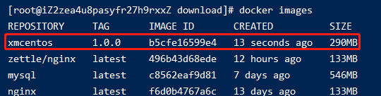

# 190-dockerFile实战1-自定义centos

## 1、编写dockerFile
编写dockerFile文件，文件名称命名为`myCentosDockerFile`
```docker
FROM centos
LABEL name="xiaoming custom centos"
LABEL buildDate="2021-01-26"

ENV WORKPATH=/home/
WORKDIR ${WORKPATH}

RUN yum -y install net-tools
RUN yum -y install vim

EXPOSE 80

CMD /bin/bash
```

## 2、执行docker build
执行命令: `docker build -f ./myCentosDockerFile -t xmcentos:1.0.0 .`

等待构建完执行`docker images`可以看到已经有该镜像了



执行`docker run -it xmcentos:1.0.0`就可以进入该镜像并且在镜像内执行net-tools和vim的相关方法了

