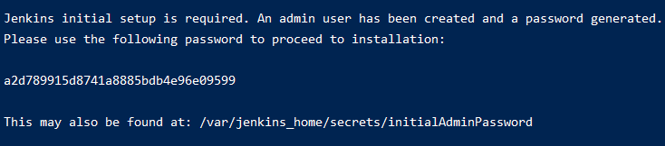
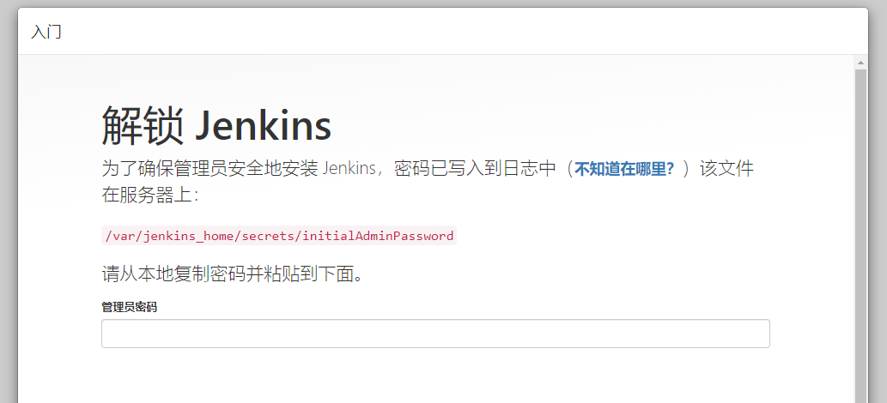
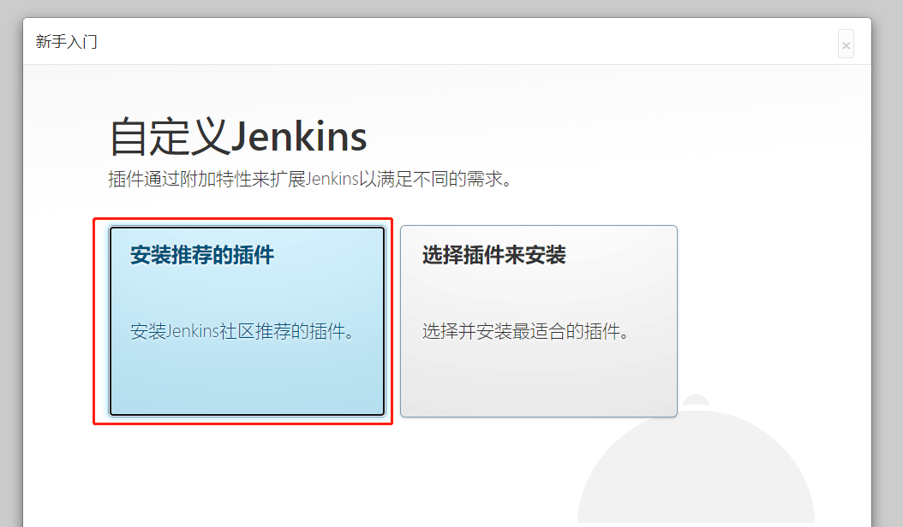
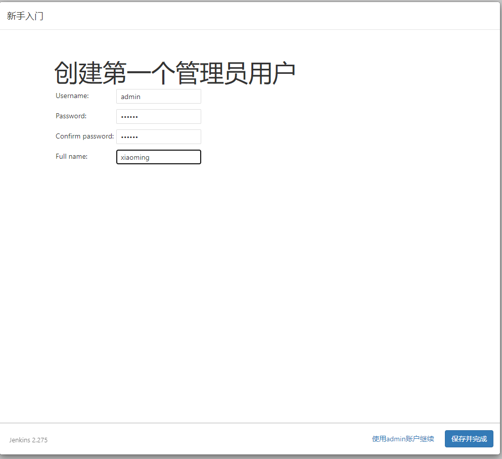
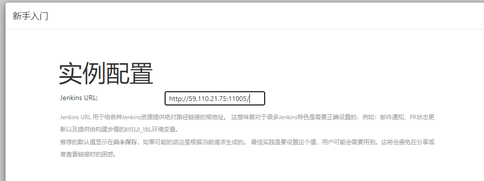
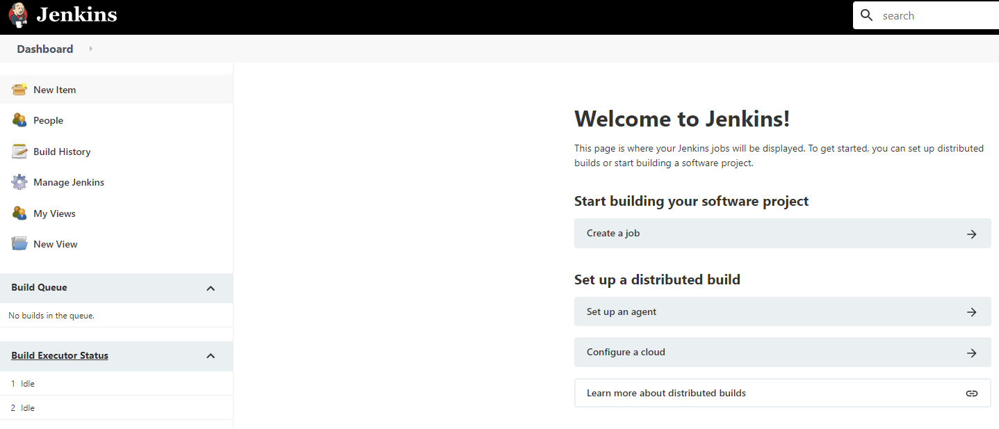

# 001-Linux安装jenkins

这里通过docker安装jenkins

## 1 使用docker启动jenkins
1. 执行下面命令
```shell
docker run \
    --name xiaoming_jenkins \
    -itd \
    -p 11005:8080 \
    -p 50001:50000 \
    jenkins/jenkins
```

执行完通过`docker ps`可以看到正在运行的容器


2. 查看密码

执行下面名称查看启动日志
```shell
# 14a863e65582为运行时候的容器id
docker logs 14a863e65582
```
可以看到这么段话



大意是：jenkins有个admin的账号，密码在`/var/jenkins_home/secrets/initialAdminPassword`，将来需要用这个账号密码初次登陆jenkins


3. 初始化
访问 `http://59.110.21.75:11005/` 出现下面界面说明启动成功



输入上面获取到的密码，得到下面界面



选择“安装推荐的插件”，出现安装失败，很可能是源的问题


输入要创建的管理员账号



配置全局的访问地址，也是jenkins的回调地址，保持默认就可以，需要的话还可以在配置里面改，在配置和gitlab的时候需要用到这个地址



保存




